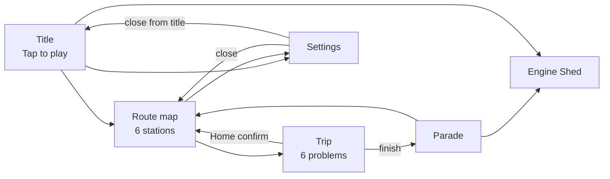
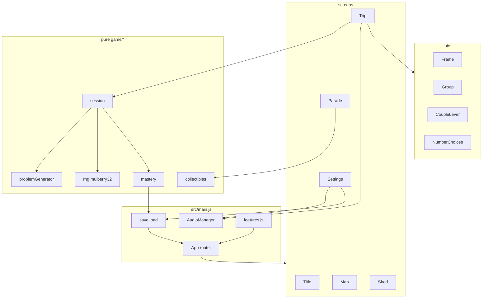

# Toot-Toot Twenty — Design Document

| Field | Value |
| --- | --- |
| **Title** | Toot-Toot Twenty: a kindergarten addition web game (sums ≤ 20) |
| **Author** | Math_Games contributors |
| **Date** | 2026-09-10 |
| **Status** | Approved |
| **Workspace** | `/Users/kkwong/00000Grok/Math_Games` (greenfield; no existing code, assets, or toolchain) |
| **Primary device** | iPad Safari on **iPadOS 16+** (touch), landscape and portrait |
| **Dev device** | Desktop Chrome |
| **Audience** | 5-year-old children (pre-readers / early readers), with occasional adult setup |
| **v1 distribution** | Static web app. No App Store. Optional Home Screen / PWA in PR 12 |
| **Host** | **Cloudflare Pages free plan** ($0, public or private GitHub repo). GitHub Pages is a $0 alternative **only if the repo is public**. |

---

## Overview

Five-year-olds learn addition by **joining two groups of real things**, not by tapping a numeral in a vacuum. This document specifies **Toot-Toot Twenty**, a single-screen-at-a-time HTML5 game in which the child is the helper at **Sunny Station**: two little trains arrive carrying two groups of animal friends; the child **couples the trains** (puts the groups together), **counts the friends**, and **chooses how many ride together**. Every problem is an addition fact whose sum is at most 20. Sessions last about 3–8 minutes. There are no accounts, no timers that punish, no fail-and-restart loops, and no third-party tracking.

The product is a **static Vite + vanilla JS** site that runs in iPad Safari 16+ and desktop Chrome. Gameplay is **DOM + CSS**, not a WebGL/canvas engine: 10-frames, tap targets, and reduced-motion are layout problems, not sprite-batch problems. Art will be generated later with Imagine (`game-asset-core`, `game-animation-frames`, `game-ui-icons`); this document freezes theme, palette, sprite list, and animation needs so that work has a contract. Progress and settings live in **one** `localStorage` blob per origin (one shared station on a family iPad).

---

## Background & Motivation

### Why a web game on iPad

The product request followed a conversation about making computer games that run on iPad. Native App Store distribution is the wrong first step: certificates, review, and update latency. An HTML5 page in Safari is installable later as a Home Screen web app, works immediately on the family iPad, and is trivial to demo on a desktop during development.

### Current state

`/Users/kkwong/00000Grok/Math_Games` is empty. There is no framework, asset pipeline, audio, or save format to extend. The design must choose stack, file layout, pedagogy, and art from scratch, and it must be concrete enough that implementation PRs can land without re-litigating the fantasy.

### Pain points this game is built to avoid

- **Worksheet-on-a-screen.** Multiple-choice numerals with no objects teach tapping, not joining. Kindergarten addition is *putting together* and *adding to* (CCSS K.OA.A.1–2).
- **Shame and speed.** Lives, red Xs, and countdown clocks produce anxiety, not fluency, at age 5.
- **Reading walls.** A 5-year-old cannot parse “Select the sum of the addends.” UI must be icon-first.
- **Tiny iPad targets.** Apple HIG minimum is 44×44 pt; children’s fingers and attention need larger, and **CSS `transform: scale` on a design canvas is forbidden** because it shrinks hit areas.
- **COPPA landmines.** Accounts, analytics SDKs, and ad networks are out of scope for a child-directed v1.

### Pedagogical background (what “good” looks like)

Typical 5-year-olds can count objects to 20 with 1:1 correspondence, subitize 1–4 (sometimes 5), and are moving from **count-all** (“1, 2, 3… 4, 5, 6”) toward **count-on** (“3… 4, 5”). Fluency within 5 is a kindergarten target; fluency within 20 is a grade-1 target. This game **covers sums to 20** as requested, but it **progresses through the strategies children actually use**, and it keeps concrete objects on screen so counting remains available.

Relevant anchors:

- CCSS K.OA.A.1, K.OA.A.2, K.OA.A.5 (add within 5 fluently), K.NBT.A.1 (11–19 as ten and some ones).
- Count-all → count-on → make-a-ten → recall (standard early-arithmetic trajectory).
- 5-frames and 10-frames as the visual organizer (not a random pile of 17 ducks).

---

## Goals & Non-Goals

### Goals (v1)

- Playable in **iPad Safari on iPadOS 16+**, both orientations, without pinch-zoom, rubber-band scroll, or accidental text selection.
- Playable in **desktop Chrome** with mouse click/drag standing in for tap/drag.
- Addition facts **a + b = s with a, b ≥ 0 and s ≤ 20**, including `0+n` (**not on Route 1**, never `0+0`), doubles, and `10+10`.
- Every round **shows two groups combining** before the child reports the total (child-driven on Routes 1–2; auto-combine on Routes 3–6 after `AUTO_COMBINE_MS` (4000) if they skip the lever).
- **Icon-first English UI**; a child who cannot read can finish a trip after one adult launch.
- **Local mastery** that moves the child from sums ≤ 5 toward 20, with review of weak facts on Route 6.
- **Cheerful SFX**, optional spoken **number names** (not full equations), always-visible **mute**.
- **COPPA-friendly:** no PII, no login, no third-party scripts, no ads, no analytics SDK.
- First contentful paint under **~1.5 s** on iPad Wi-Fi; interaction at 60 fps for CSS transforms.
- A documented asset list so Imagine generation can proceed without redesigning the game.

### Non-goals (v1)

- Subtraction, missing-addend, multiplication, or mixed operations.
- Multiplayer, leaderboards, cloud saves, **multiple child profiles**, family accounts, or a “parent dashboard.” One iPad origin = one station.
- App Store / TestFlight / Capacitor / React Native wrappers.
- User-generated content, chat, or any network call after page load (except fetching the static files themselves).
- Full VoiceOver-first gameplay for the child (we still label controls so an adult or a child who uses VoiceOver is not blocked).
- Localization beyond English.
- Adaptive AI tutoring, speech recognition, or camera/AR counting.
- Loot boxes, energy timers, daily-streak punishment, or in-app purchases.
- A custom bundler plugin ecosystem, CSS-in-JS, or a 3D engine.
- Background music on by default (flag exists, default `false`).
- Live cloud TTS.

---

## Key Decisions

| # | Decision | Rationale |
| --- | --- | --- |
| K1 | **Name: Toot-Toot Twenty.** World: **Sunny Station**. Fantasy: child is station helper who couples two trains of animal friends and counts who rides together. | Onomatopoeia is memorable for age 5; “Twenty” states the math ceiling; trains *literally couple*, which is the addition metaphor. |
| K2 | **One theme, not a fork:** toy railway + animal passengers + cargo cars. Toy cars appear as **flatbed cargo**, not a second game. | The request allowed cars, trains, or animals. Combining them into one station world avoids split art pipelines and still honors all three. |
| K3 | **Core mechanic: combine two groups, then report the total.** Drag-to-couple is optional; a large **couple lever** is the reliable tap path. | Pedagogy requires seeing groups join. Pure multiple-choice is a non-goal. Drag alone is too error-prone for 5-year-olds on iPad. |
| K4 | **Part-part-whole coloring:** addend A and addend B are **different species** (or different cargo colors) and stay visually distinct after joining. | If every object is the same, the parts vanish and the child cannot recount “the ducks and the bunnies.” |
| K5 | **Organizers: 5-frame then 10-frame (two frames for 11–20), not a long linear train of 20 cars in portrait.** | Kindergarten structure for 11–19 is “ten and some ones.” Linear trains overflow small viewports. |
| K6 | **No punishing timer. Rewards are guaranteed for finishing a trip; extra sparkle for first-try answers.** | Age-appropriate motivation. Gating collectibles on perfect accuracy produces frustration, not practice. |
| K7 | **Stack: Vite 6 + vanilla JS ES modules + CSS + Vitest. No React, no Phaser, no TypeScript in v1.** | Small surface, static deploy, easy for an implementation agent to extend. DOM gives real buttons, focus, and `prefers-reduced-motion` for free. Canvas/Phaser would fight accessibility and 10-frame layout. |
| K8 | **Input: Pointer Events only** (`pointerdown`/`pointerup`/`pointermove`), 450 ms answer lock, `touch-action: manipulation`. | Unifies iPad finger, Apple Pencil, and desktop mouse. Prevents double-submit and double-tap zoom. |
| K9 | **Answers are large choice buttons, never a software keyboard.** 3 choices on Routes 1–2, 4 on Routes 3–5 and as the Route 6 default. Route 6 may upgrade to a **7×3 pad of 0–20** (64 px min, **520×216** = `7×64 + 6×12` by `3×64 + 2×12`) only when `useStrip(...)` is true — a real **fits** check on `{width, height, layout}`, not width-only. If it does not fit, 4 choices. | The iOS keyboard wrecks `visualViewport`. A 4×6 pad at 64 px is 444 px tall and does not fit; 7×3 at **520×216** does on landscape 744-tall. |
| K10 | **Save: `localStorage` key `tootTootTwenty.v1` only.** No cookies, no fingerprint, no remote logging. | COPPA, privacy, offline. Progress loss if Safari clears data is accepted. |
| K11 | **Audio: one `AudioContext`; `fetch` + `decodeAudioData` + `AudioBufferSourceNode`. No `<audio>` elements.** Unlock on the title “Tap to play” `pointerup`. In-game mute is the only mute we can detect. | Mixing `HTMLAudioElement` and Web Audio is a known iOS failure mode. Hardware mute is undetectable from the page. |
| K12 | **Six routes in v1, 6 problems per trip, ~3–8 minutes.** Route 6 (Sunny Express) is mixed review, not a seventh idea. | Matches attention span. Cutting Route 6 would leave no review mode. |
| K13 | **Hint ladder, never shame:** miss 1 = retry; miss 2 = auto-count; miss 3 = reveal and still require a tap on the correct numeral. | The child always performs the successful action. No red X, no sad face, no “Wrong!” |
| K14 | **Art contract frozen here; pixels come later via Imagine.** Placeholders (CSS shapes + emoji-free SVG) ship first. | Implementation of logic must not wait on illustration. Style anchors prevent asset drift. |
| K15 | **Baseline: iPadOS 16 / Safari 16** (container queries, `:has()`, `dvh`, Vite’s modern targets). | `cq*` units are Safari 16+, not 15.4. “Current iPad” in 2026 is ≥ 16. |
| K16 | **The 6th correct tap is trip-complete.** On that tap, synchronously persist mastery for the problem **and** the trip-finished row (`tripsCompleted`, `tripsByRoute[n]++`, `maybeUnlock`, collectible). Then play the ≤1.8 s celebration and go to the **reward screen** (PR 6: All-aboard stub → Map; PR 8: `ParadeScreen`). Home during that celebration is **skip-reward** (Map, no rollback). Abandon (no collectible, no trip bump) applies only when `problemIndex < 6` **or** the current problem is unsolved. Problems 1–5 persist mastery on their correct tap only. Refresh mid-trip returns to Title. | Removes the 6th-tap vs Parade-mount race. PR 6 must not import `ParadeScreen.js`. |
| K17 | **Single local profile per origin.** Siblings share one station. | Family accounts are a non-goal; stating the consequence prevents a later “just add profiles” surprise. |
| K18 | **Layout is unscaled CSS (flex/grid + container queries). No 1024×768 `transform: scale` canvas.** iPad 1/3 split-view is unsupported. | Scaling a design canvas shrinks tap targets below the 88 / 64 px floors. |
| K19 | **Adult-only actions live in Settings, behind hold-sun 3 s + confirm.** No secret tap codes on the title art. DEV overlay is `Shift+D` on a fine-pointer, zero-touch desktop. | Five taps on a cute sun is a child gesture, not an adult gate. |
| K20 | **Voice is baked TTS MP3s in-repo** (`zero`…`twenty`, `try-again`). Generate once at asset time; never live cloud TTS. PR 7 ships oscillators; PR 10 swaps files under the same `AudioManager` API. Recorded human is out of v1. | User decision 2026-09-10. No network after load; no cloud TTS vendor. |
| K21 | **v1 host is Cloudflare Pages free plan** ($0 for a static site, preview URLs, `_headers` in-repo, works with a public **or private** GitHub repo). GitHub Pages is documented as $0 **only for a public repo**; private-repo Pages is not the free path. | User asked which option is free of charge. Cloudflare is free either way; already the default. |
| K22 | **Route 1 equation numerals fade in during counting.** Do not hide until after the first correct tap. Do not show the full equation from the start of the round. Routes 2+ show `a + b = ?` throughout. | User decision 2026-09-10. Objects lead; numerals appear as the child counts. |

---

## Proposed Design

### 1. Game name, theme, and fantasy

**Name:** Toot-Toot Twenty  
**Place:** Sunny Station, a bright hillside toy railway.  
**Role:** The child is the **station helper** (a small conductor cap icon, not a customizable avatar — no PII, no photo).  
**Cast (v1 playable species, 10):** duck, bunny, puppy, kitten, bear, frog, fox, panda, hedgehog, owl. Duck and bunny are starters (always used in play from trip 1). The other eight are also used in play from the start (rotating pairs) **and** are Engine Shed collectibles. Toy cars ride as **cargo on flatbeds** so the “cars” theme is present without a second art style.

**Why this theme, not “pick later.”**

- **Trains couple.** Two engines sliding together *is* addition. A frog on a number line is ordinal and harder to count; a parking lot of identical cars loses part-part-whole unless colors differ.
- **Animals are countable friends**, not abstract counters. Species difference encodes the two addends.
- **Toy-wood + plush** reads as safe and cute, photographs well at high contrast, and is a clear Imagine style (Sago Mini / Khan Kids / modern wooden-railway toy).
- One world = one palette, one lighting model, one UI chrome.

**Tone of voice (when words appear):** short, warm, never evaluative of the child. “Let’s couple!” / “Let’s count!” / “All aboard!” / “Try that again.” Never “Wrong,” “Too slow,” or “You failed.” Spoken audio in v1 is **number names only** (see §12), not full equations.

### 2. Core loop (one round)

Each round is one addition fact. Target duration: **20–50 seconds**, including counting.

```mermaid
sequenceDiagram
    autonumber
    participant C as Child
    participant UI as TripScreen
    participant S as Session
    participant A as Audio
    participant P as persist()

    S->>UI: Problem (a, b, species, choices, frameSize, frameCount)
    UI->>UI: spawn group A, group B, hidden frame tray (5- or 10-cell)
    UI->>C: icon prompt (two trains + plus + couple lever)
    alt Routes 1–2: child must combine
        C->>UI: lever tap or drag
        UI->>S: applyCombine
        UI->>A: clank + short toot
        UI->>UI: animals walk into frame tray; answers enable
    else Routes 3–6: auto-combine after AUTO_COMBINE_MS (4000) if unused
        alt Child uses lever first
            C->>UI: lever tap or drag
        else Timer fires
            UI->>S: applyCombine (auto)
        end
        UI->>UI: presentation (count-on walk-on and/or make-ten split)
        UI->>UI: answers enable
    end
    opt Child taps an animal
        C->>UI: tap-to-count
        UI->>A: speakNumber(n)
        UI->>UI: pulse + caption numeral for the pulse duration
    end
    C->>UI: tap answer choice
    UI->>S: applyAnswer(value)
    alt incorrect
        UI->>A: nudge + speak "try again" only on miss 1
        UI->>UI: hint ladder (retry / auto-count / reveal)
        Note over S: FactStats not written until a later correct tap
    else correct and problemIndex < 5
        S->>P: persist mastery (+ recentByRoute)
        UI->>A: cheer + speakNumber(sum)
        UI->>UI: stamp ≤1.8s
        UI->>S: advance(session, now)
        Note over S: combined=false, hintLevel=0, misses=0
        S->>UI: next Problem
    else correct on problem index 5 (6th problem)
        S->>P: persist mastery AND trip-finished row (K16)
        UI->>A: cheer + speakNumber(sum)
        UI->>UI: stamp ≤1.8s (Home = skip reward, no rollback)
        UI->>UI: PR 6 All-aboard stub → Map; PR 8 replaces stub with ParadeScreen
    end
```

**What the child does, in order:**

1. **See** two groups (left platform / right platform) with a large `+`.
2. **Combine** by tapping the green couple lever (primary) or dragging one group onto the other (optional sugar). On Routes 3–6 the game will combine for them after **`AUTO_COMBINE_MS` (4000)** if they have not.
3. **Count** if they need to: tap friends one-by-one; on later routes, count-on highlights the second group only.
4. **Tell how many** by tapping one large numeral (answers are **disabled** until `session.combined === true`).
5. **Celebrate** a short animation, then the next pair of trains arrives.

The equation `3 + 2 = ?` is visible from Route 2 onward. On Route 1, numerals on the equation **fade in as the child counts** (K22) — not hidden until the first correct tap, and not shown in full at round start — so the objects lead.

### 3. Screen map



| Screen | Purpose | Child / adult actions |
| --- | --- | --- |
| **Title** | Unlock audio, set the world, start. | One giant green engine button. Mute in the corner. Settings gear. **The sun is not a hidden button.** |
| **Route map** | Choose difficulty band. Locked routes are visible but grayed with a lock icon. | Tap an unlocked station. Recommended station (see §7) has a bouncing ticket. Settings gear. |
| **Trip** | Core loop × 6. | Combine, count, answer. Home icon → confirm (stay / leave) while a problem is unsolved or `problemIndex < 6`. After the 6th correct tap, Home **skips the parade** (Map, collectible already written). Leave from an unsolved problem returns to **Map**, not Title. Progress is 6 ticket punches. |
| **Parade** | Reward. Child’s train, including newly unlocked car/animal, crosses the screen (~6–8 s). | Tap to skip after 1.5 s. |
| **Engine Shed** | Collection gallery. | Horizontal swipe. Locked slots are silhouettes. Close returns to Map. |
| **Settings** | Mute, voice, reduced-motion override, **adult panel**. | Mute/voice icon toggles. Close/check in the corner. Adult: **hold the sun 3 s** → sheet with Unlock-all (open lock) and Reset (eraser), each with a second confirm. |

No onboarding slideshow. The first Route 1 problem *is* the tutorial: the couple lever pulses until used; the correct numeral does not pulse until hint 3.

### 4. Modes, routes, and problem generation

There is **one mode**: trip play. Variety comes from **routes** (difficulty bands) and from **strategy presentation**, not from mini-game switching.

Each route row splits into a **hard filter** (what `nextProblem` may emit) and a **hard presentation** (how TripScreen must show it). Flavor text is not a filter.

#### 4.1 Routes

| Route | Station | **Filter (hard)** | **Presentation (hard)** | Frame | Choices | Combine |
| --- | --- | --- | --- | --- | --- | --- |
| 1 | Garden Siding | `a,b ≥ 1` and `1 ≤ a+b ≤ 5`. **No zeros.** | `count-all`. Equation numerals **fade in during count** (K22). | `frameSize: 5`, `frameCount: 1` | 3 | Required (answers disabled until combine) |
| 2 | Meadow Track | `a,b ≥ 0`, never `0+0`, `6 ≤ a+b ≤ 10`. Trip caps: **≤ 1 zero**, **≥ 1 make-ten** (`a+b === 10` and `a,b ≥ 1`). | If `min(a,b) ≤ 2` then `count-on`, else `count-all`. | `frameSize: 10`, `frameCount: 1` | 3 | Required |
| 3 | River Bridge | `a,b ≥ 1`, `min ∈ {1,2,3}`, `max ≥ 4`, **`6 ≤ a+b ≤ 12`**. (No Route 1 sums.) | Always `count-on`: larger group badged, smaller group walks on. | `frameSize: 10`, `frameCount: sum≤10 ? 1 : 2` | 4 | Optional (auto-combine at `AUTO_COMBINE_MS`) |
| 4 | Ten Town | `a,b ≥ 1`, `11 ≤ a+b ≤ 15` | **20-cell ribbon** (§4.3). Equation stays `a + b = ?` (no addend swap). If `makeTenSplit` (first ten incomplete: `a < 10 && a+b > 10`) play the make-ten walk. If `a ≥ 10`, frame 1 is already a full ten of A; remainder of A plus B sit in frame 2 (ten-and-some-ones, no walk). | `frameSize: 10`, `frameCount: 2` | 4 | Optional (auto-combine at `AUTO_COMBINE_MS`) |
| 5 | Summit Line | `a,b ≥ 1`, `16 ≤ a+b ≤ 20` | **Same 20-cell ribbon.** If `a===b` → doubles pulse. Else if `makeTenSplit` → make-ten walk. Else if `a ≥ 10` → count-on with a completed-ten badge on frame 1. Else `count-on`. **Do not** key make-ten off `min===9` (that disagrees with packing when `a ≥ 10`, e.g. `11+9`). Presentations, not filters. Pool is all sums 16–20. | `frameSize: 10`, `frameCount: 2` | 4 | Optional |
| 6 | Sunny Express | See §4.3 Route 6 sampler. Legal facts are the **union of filters 1..frontier**. | Same presentation function as the fact’s **frontier-home route** (the highest route whose filter contains it). Default `count-on` if none. | From that presentation | 4, or 7×3 strip if `useStrip` | Optional |

**Unlock rule (measurable in 3×6 problems; no per-fact streak quota):**

Let `tripsByRoute[n]` be completed trips on route `n`. Let `recentByRoute[n]` be a ring buffer of the last **12** `{ triesUntilCorrect }` values for problems **played on that route**.

- Route 1 is always unlocked.
- Route `n+1` (for `n` in 1..5) unlocks when **all** of:
  1. `tripsByRoute[n] ≥ 3`
  2. `recentByRoute[n].length === 12`
  3. **at least 10 of those 12** entries have `triesUntilCorrect ≤ 2` (first try or one retry — i.e. success before auto-count). Integer test: `count >= 10`, not `count/12 >= 0.80`.
- `highestRouteUnlocked` is **stored**. `maybeUnlock(save)` may **raise** it, never lower it, except on Reset.
- If `adultUnlockedAll === true`, `highestRouteUnlocked` is forced to 6 and `maybeUnlock` does not lower it.

`triesUntilCorrect` is `1` on a first-try hit, `2` after one miss, `3` after the auto-count success, `4` after reveal. It is **per problem**, not per tap in a raw log of every wrong press mixed with rights.

**Everyone who finishes 6 problems gets the parade.** Unlocking the *next route* is the skill gate; unlocking the next *collectible* is not.

#### 4.2 Fact space

Let `A, B ∈ {0,…,20}` with `A + B ≤ 20`. Ordered pairs: 231. Canonical keys: 121 (`sum_{s=0}^{20}(⌊s/2⌋+1)`). Mastery key is `min+max`, e.g. `"3+5"`. **Display order** is 50/50 so the child sees `3+5` and `5+3`.

**Zero policy (single rule):**

- **Never** `0+0`.
- **Route 1: zeros banned** (`a,b ≥ 1`).
- **Routes 2–6: at most one zero-addend problem per trip**, enforced in `generateTrip` (hard cap, not a weight).
- A zero addend renders as an **empty platform** with a dotted frame and no animals (“nobody waiting”). `speciesA` or `speciesB` is `null` on the empty side.

`0` is **not** 5% of Route 1. Percentage slogans are not part of the contract; the weight function plus trip caps are.

#### 4.3 Generator interface

Pure functions in `src/game/problemGenerator.js` plus `src/game/rng.js`. No DOM. **`nextProblem` never throws.**

```js
/** @typedef {'count-all' | 'count-on' | 'make-ten' | 'recall'} Strategy */

/**
 * @typedef {Object} Problem
 * @property {number} a
 * @property {number} b
 * @property {number} sum
 * @property {string} factKey           // `${min}+${max}`
 * @property {number} routeId           // 1..6
 * @property {Strategy} strategy        // presentation, not a filter
 * @property {string|null} speciesA
 * @property {string|null} speciesB     // ≠ speciesA whenever a>0 && b>0
 * @property {number[]} choices         // 3 or 4, shuffled, includes sum; unused when input==='strip'
 * @property {'choices'|'strip'} input
 * @property {boolean} requireCombine
 * @property {5|10} frameSize
 * @property {1|2} frameCount
 * @property {boolean} makeTenSplit     // a < 10 && a+b > 10 (first ten incomplete)
 * @property {number} splitIntoFirst    // makeTenSplit ? 10-a : 0; B animals that walk into frame 1
 */

/** Seeded RNG used by tests and generateTrip. */
export function mulberry32(seed) {
  let t = seed >>> 0;
  return function rng() {
    t += 0x6D2B79F5;
    let r = Math.imul(t ^ (t >>> 15), 1 | t);
    r ^= r + Math.imul(r ^ (r >>> 7), 61 | r);
    return ((r ^ (r >>> 14)) >>> 0) / 4294967296;
  };
}

/**
 * @param {object} args
 * @param {number} args.routeId
 * @param {MasteryState} args.mastery
 * @param {() => number} args.rng
 * @param {string[]} args.recentKeys      // last 8 canonical keys (SOFT penalty)
 * @param {string[]} args.usedThisTrip    // hard-exclude until the legal pool is empty
 * @param {number} args.zerosUsedThisTrip
 * @param {number} args.tripIndex         // 0..5, for species rotation
 * @returns {Problem}                     // always a valid Problem; never throws
 */
export function nextProblem(args) { /* ... */ }

/** @returns {Problem[]} length 6 */
export function generateTrip({ routeId, mastery, seed, recentKeys }) { /* ... */ }

/**
 * Distractors: prefer {sum-1, sum+1, max(a,b), a, b, sum-10 if sum≥10}.
 * Filter to integer 0..20, unique, ≠ sum. Fill remaining with nearest unused 0..20.
 * Deterministic given (a, b, count, rng) — tests pass mulberry32(seed).
 */
export function makeChoices(a, b, count, rng) { /* ... */ }
```

**Sampling weights (applied to each legal *ordered* pair, then sampled):**

1. Start at `1`.
2. Route 1: `×2.2` if `min(a,b)===1`; `×1.6` if `a===b`. (No zero term — zeros are illegal.)
3. Routes 2–6: `× (1 + 2*(1 - strength(factKey)))` so weak facts surface. Unseen facts have `strength 0` → ×3.
4. **Soft anti-repeat:** if `factKey` is in `recentKeys` (last 8 **completed** keys, persisted), `×0.15`. **Never set weight to 0 for this reason.**
5. **Hard trip uniqueness:** drop pairs whose `factKey` is in `usedThisTrip`, **unless that would empty the legal pool**, in which case ignore `usedThisTrip` for this draw (prefer a different display order than the previous occurrence if `a !== b`).
6. **Hard zero cap:** if `zerosUsedThisTrip ≥ 1`, drop pairs with a zero addend.
7. If every remaining weight is 0, fall back to uniform over the hard-filtered pool (still honoring route filter + zero cap).
8. If that pool is empty (should not happen), return the **fallback fact** for the route (DEV: `console.warn`): Route 1 `1+1`; Route 2 `4+4`; Route 3 `3+5`; Route 4 `6+6`; Route 5 `8+8`; Route 6 `1+1`. Still a valid `Problem`.

There is **no** “35% plus-one” target. The ×2.2 bias is the contract.

**Trip-level guarantees (`generateTrip`, not the weight function):**

- Length 6.
- Route 2: if none of the six is a make-ten pair (`a+b===10` and `a,b≥1`), **replace index 5** with a make-ten fact sampled from that subset, avoiding `usedThisTrip` if possible.
- Routes 2–6: `zerosUsedThisTrip ≤ 1` by construction.
- After building six, assign `choices` via `makeChoices` and species via the rotating pair list.

**Route 6 sampler**

- `frontier = min(mastery.highestRouteUnlocked, 5)` (Route 6 is mixed, not a new sum band).
- `weak` = canonical keys that (a) lie in the union of filters 1..`frontier`, and (b) `isWeak(fact)` as defined in §5 (`seen > 0` and low strength — **unseen is not weak**).
- For each of 6 slots: with probability 0.3 if `weak.length > 0`, sample from `weak` (still applying trip uniqueness + recentKeys soft penalty); otherwise sample from the **frontier route’s filter**.
- If `weak.length === 0`, 100% frontier.
- **Strip vs 4-choice:** `generateTrip` always sets `input: 'choices'`. TripScreen may upgrade at render time iff `useStrip(problem, mastery, features, { width, height, layout })` (same function as §8). Tests lock that function, not a width-only shortcut.

```js
/** 7 columns × 3 rows of 0–20 (21 cells, no unused). */
export const STRIP_COLS = 7;
export const STRIP_ROWS = 3;
export const STRIP_CELL = 64;
export const STRIP_GAP = 12;
export const STRIP_MIN_WIDTH  = 7 * 64 + 6 * 12; // 520
export const STRIP_MIN_HEIGHT = 3 * 64 + 2 * 12; // 216
export const CHROME_BAND = 64;
export const FRAME_BAND = (frameCount) => (frameCount === 2 ? 132 : 108);

/**
 * @param {Problem} problem
 * @param {MasteryState} mastery
 * @param {typeof features} features
 * @param {{ width: number, height: number, layout: 'wide'|'stacked'|'unsupported' }} box
 */
export function useStrip(problem, mastery, features, box) {
  if (!features.route6Strip) return false;
  if (problem.routeId !== 6) return false;
  if (!isMastered(mastery.facts[problem.factKey] || { seen: 0, correctFirst: 0, streak: 0 })) return false;
  if (box.layout === 'unsupported') return false;
  const remainingW = box.width - 24;
  const remainingH = box.height - CHROME_BAND - FRAME_BAND(problem.frameCount);
  return remainingW >= STRIP_MIN_WIDTH && remainingH >= STRIP_MIN_HEIGHT;
}
```

On a 1024×744 landscape shell after combine, remaining height is `744 - 64 - 132 = 548` ≥ 216 and remaining width is `1024 - 24 = 1000` ≥ **520**, so the pad **does** ship on iPad landscape. On a ~512 CSS-px 1/2-split, `remainingW ≈ 488 < 520` → 4 choices. Tests: `useStrip` is **false** when `remainingW === 519`; **true** for mastered Route 6 on 1024×744.

**20-cell ribbon packing (Routes 3–6 when `frameCount === 2`; also the combine target on Route 2’s single 10-frame as cells `0..9` only):** two 10-frames are **one ribbon**, left-to-right, top-to-bottom, frame 1 = cells `0..9`, frame 2 = cells `10..19`. Generator `a` / `b` stay on the equation (`a + b = ?`). Animals occupy sequential cells:

```js
/** @typedef {{ species: 'A'|'B', cell: number, frame: 1|2 }} PackedAnimal */

/** Species A in cells 0..a-1; species B in a..a+b-1. Never more than 10 per frame. */
export function packAnimals(a, b) {
  const out = [];
  for (let i = 0; i < a; i++) out.push({ species: 'A', cell: i, frame: i < 10 ? 1 : 2 });
  for (let i = 0; i < b; i++) {
    const cell = a + i;
    out.push({ species: 'B', cell, frame: cell < 10 ? 1 : 2 });
  }
  return out;
}

/** Make-ten is an animation on top of packing, not a second placement rule. */
export function makeTenFields(a, b) {
  const makeTenSplit = a < 10 && a + b > 10;
  return { makeTenSplit, splitIntoFirst: makeTenSplit ? 10 - a : 0 };
}
```

Examples (no tray is asked for 11+ animals):

| `a+b` | Ribbon | Make-ten walk? |
| --- | --- | --- |
| `5+8` | A in 0–4; B in 5–12. Frame 1 = 5A+5B; frame 2 = 3B | Yes, `splitIntoFirst = 5` of B walk into frame 1 |
| `8+5` | A in 0–7; B in 8–12. Frame 1 = 8A+2B; frame 2 = 3B | Yes, `splitIntoFirst = 2` |
| `1+14` | A in 0; B in 1–14. Frame 1 = 1A+9B; frame 2 = 5B | Yes, `splitIntoFirst = 9` |
| `14+1` | A in 0–13; B in 14. Frame 1 = 10A; frame 2 = 4A+1B | **No** (`a ≥ 10`; first ten already all A) |
| `11+9` | A in 0–10; B in 11–19. Frame 1 = 10A; frame 2 = 1A+9B | **No** (`a ≥ 10`). Not `min===9` make-ten |
| `10+5` | A in 0–9; B in 10–14. Frame 1 = 10A; frame 2 = 5B | **No** (completed ten + some ones) |
| `16+4` | A in 0–15; B in 16–19. Frame 1 = 10A; frame 2 = 6A+4B | **No** |

The walk, when `makeTenSplit`, is: the first `splitIntoFirst` B animals (cells `a .. 9`) animate from platform B into those cells; remaining B already belong in frame 2. The equation is never rewritten as `8 + 2 + 3`. **Do not swap** `a` and `b` to put the larger on the left.

`src/game/pack.js` (PR 3, pure). `Frame.js` (PR 5) only renders `packAnimals` output — it must not place “all of `a` in tray 1.”

**Species rotation (hard):**

```js
export const SPECIES_PAIRS = [
  ['duck', 'bunny'],
  ['puppy', 'kitten'],
  ['bear', 'frog'],
  ['fox', 'panda'],
  ['hedgehog', 'owl'],
];
// pair = SPECIES_PAIRS[(tripsCompleted * 6 + tripIndex + routeId) % 5]
```

If `a===0`, `speciesA = null` and `speciesB = pair[1]`. If `b===0`, `speciesB = null`. Otherwise `speciesA = pair[0]`, `speciesB = pair[1]` (always distinct).

**Invariants the unit tests must lock:**

1. `a >= 0 && b >= 0 && a + b === sum && sum <= 20`.
2. `choices` contains `sum` exactly once when `input==='choices'`; all choices are integers in `0..20`.
3. `speciesA !== speciesB` whenever `a > 0 && b > 0`; empty side is `null` iff that addend is 0.
4. Route **filters** in the table hold (not the presentation column).
5. `generateTrip` returns 6 problems; factKeys unique unless the legal pool is smaller than remaining slots.
6. `makeChoices` is deterministic given `(a,b,count,mulberry32(seed))`.
7. **`nextProblem` always returns a valid problem for 100 sequential draws on every routeId 1..6, including when `recentKeys` is 8 keys and `usedThisTrip` is 6 keys.**
8. Route 1: no zeros. Never `0+0`. Routes 2–6 trips: `count(zeros) ≤ 1`.
9. Route 2 trips: at least one make-ten pair.
10. `frameSize` / `frameCount` match the table (Route 3 `frameCount` depends on `sum`).
11. `makeTenFields(a,b)`: `makeTenSplit === (a < 10 && a+b > 10)`; `splitIntoFirst === makeTenSplit ? 10-a : 0`. Independent of `b < 10` and of `min===9`.
12. Never throws.
13. `useStrip` is false when remaining width `< 520` or remaining height `< 216`, even if `routeId===6` and the fact is mastered. False at `remainingW === 519`; true on 1024×744 mastered Route 6.
14. `packAnimals(a,b)`: `length === a+b`; unique `cell` in `0 .. a+b-1` (hence `≤ 19`); `frame` is 1 iff `cell < 10`; species A occupies `0..a-1`; species B occupies `a..a+b-1`; **no frame is asked to render more than 10 animals.** Covers `1+14`, `14+1`, `16+4`, `11+9`.

### 5. Mastery tracking

Module: `src/game/mastery.js`.

Per canonical fact (`FactStats`), stored:

```js
{
  seen: 0,            // completed problems (always ended with a correct tap)
  correctFirst: 0,    // triesUntilCorrect === 1
  correctRetry: 0,    // triesUntilCorrect >= 2
  wrong: 0,           // miss *events* (0–3 per problem, accumulated)
  streak: 0,          // consecutive first-try corrects; any miss this problem sets 0
  lastTs: 0
}
```

`strength` is **derived**, never stored:

```text
strength = clamp01(
  0.45 * (correctFirst / max(1, seen))
+ 0.25 * (correctRetry / max(1, seen))
+ 0.30 * clamp01(streak / 4)
)
```

**State table — counters update only when the problem completes** (the child taps the correct numeral). An abandoned in-flight problem writes **nothing**.

| Outcome | `triesUntilCorrect` | seen | correctFirst | correctRetry | wrong | streak |
| --- | --- | --- | --- | --- | --- | --- |
| First-try hit | 1 | +1 | +1 | — | — | +1 |
| Miss, then retry success (hint 1) | 2 | +1 | — | +1 | +1 | **set 0** |
| Miss, auto-count, then success (hint 2) | 3 | +1 | — | +1 | +2 | **set 0** |
| Miss, auto-count, reveal, then success (hint 3) | 4 | +1 | — | +1 | +3 | **set 0** |

Invariant after every complete: `correctFirst + correctRetry === seen`. `wrong` is not redundant: it counts miss events, not problems.

```text
isWeak(fact)     = seen > 0 && (strength < 0.4 || (streak === 0 && wrong > 0))
isMastered(fact) = seen ≥ 4 && streak ≥ 3 && (correctFirst / seen) ≥ 0.75
isUnseen(fact)   = seen === 0
```

Unseen facts are **not** in the Route 6 weak bucket (they arrive via the 70% frontier sampler).

**Trip scoring (parade sparkle only, not collectible gating):**

- First-try correct: 2 toots (internal; never shown as a score).
- Correct on hint-1 retry: 1 toot.
- Correct after auto-count or reveal: 0 toots; the problem still completes.
- Stars: `min(3, floor(toots / 4))`. Always a parade; stars are extra glitter.

No numeric score is shown to the child. Ticket punches (1 of 6) are the only progress chrome during a trip.

**`maybeUnlock(save)`** (called on the **6th correct tap**, as part of the trip-finished persist, before celebration/parade):

```text
if (save.mastery.adultUnlockedAll) {
  save.mastery.highestRouteUnlocked = 6
  return
}
n = save.mastery.highestRouteUnlocked
while (n < 6 && unlockMet(save, n)) n++
save.mastery.highestRouteUnlocked = n

unlockMet(save, n):
  tripsByRoute[n] ≥ 3
  AND recentByRoute[n].length === 12
  AND count(triesUntilCorrect ≤ 2) ≥ 10
```

Adult override and derived unlock never fight: adult sets a flag; reset clears both flag and counters.

### 6. Input model (iPad first)

| Gesture | Use | Notes |
| --- | --- | --- |
| **Tap** (`pointerup` on same target, movement < 24 px) | Couple lever, answers, mute, map, skip parade, settings close | Primary. Hit area ≥ **88×88 CSS px** for answers (choice mode) and lever; ≥ **64×64** for mute/home/close. Visual glyph may be smaller; padding makes the target. **Unscaled** — see §8. |
| **Drag** | Optional combine: pointerdown on group A, move onto group B, pointerup | Drop outside → spring back. `touch-action: none` on the stage. |
| **Tap-to-count** | Pointerup on an animal | Speaks that animal’s count-index in left-to-right, top-to-bottom frame order. |
| **Hold 3 s** | Settings sun → adult sheet | Visual fill ring. Cancel on early pointerup. **Only in Settings, never on Title.** |
| **Click** | Desktop equivalent of tap | Same Pointer Events path. |
| **Keyboard** | Desktop-only: `1–4` select visible choices, `M` mute, `Shift+D` DEV overlay | Bind **only if** `matchMedia('(pointer: fine)').matches && navigator.maxTouchPoints === 0`. Do not steal an iPad hardware keyboard. **No `<input>`, no `contenteditable`, no `textarea`.** |

**Routes 1–2, answers before combine:** answer buttons are `disabled` / `aria-disabled` (visually dim, still visible). A tap on them **wiggles the lever** and plays `nudge`. They are not silent no-ops.

**Routes 3–6:** answers stay disabled until `combined` (auto or child). Auto-combine fires at **`AUTO_COMBINE_MS = 4000`** (`src/game/session.js` named constant; tests assert this value, not a raw `1000`). That delay is long enough to see the two groups as parts before count-on / make-ten. Lever or drag **cancels** the timer and combines immediately. Reduced-motion: still wait the same 4000 ms, then **snap** join (no walk tween) — do not join at t=0, and do not hold a still scene with no deadline.

**Wrong-answer handling (hint ladder):**

| Miss # | What happens | What never happens |
| --- | --- | --- |
| 1 | Soft wobble of the chosen button (or fade if reduced-motion), that button dims, voice `try-again`, other choices remain. | Red X, buzz, life lost, animals crying. |
| 2 | Auto-count: each friend pulses in order at **420 ms/item** (280 ms if reduced-motion), `speakNumber` + caption for **that same duration**, then wait. | Skipping the child’s agency. |
| 3 | Correct numeral gets a halo; combined group shows a large total badge; child **must tap** the correct choice (only that one stays enabled). | Auto-advance without a successful tap. |

`applyAnswer` owns miss vs hit (no separate `applyMiss`). It returns `{ ignored, wiggle, correct, hintLevel, triesUntilCorrect, tripDone }`. `ignored: true` when `!combined`.

**Double-tap / double-submit:**

- After any answer `pointerup`, ignore further answer input for **450 ms** and until the celebration/hint overlay lifts (`pointer-events: none` on the **stage**, not on mute/home). Home stays tappable during the 6th-problem stamp (skip-parade).
- Couple lever disables after a successful combine until the next problem.
- CSS: `touch-action: manipulation` on `html, body`. Do **not** rely on `user-scalable=no`.

**Accidental drag vs tap:** if `pointermove` exceeds 24 px before `pointerup` on an answer button, cancel that tap. Answer buttons do not drag.

### 7. Celebration and reward loop

**Economy (intentionally tiny):**

- **Ticket punch:** one per completed problem (6 fill a trip card). Not persisted (session-only).
- **Parade:** every **completed** trip (not on abandon). The child’s train rolls left → right. New unlocks ride in the last car.
- **Collectibles:** 24 items, one new item per completed trip, fixed order. **`unlockedIds` never grows past 24 and never contains duplicates.** After 24 trips, persist `nextIndex` only; the shed still has 24 slots; a star-stamp overlay sits on the current engine `engine-{red,yellow,blue,green,cream,purple}[(nextIndex - 1) % 6]`. **No hat art, no duplicate ids.**
  - 6 engines: `engine-red`, `engine-yellow`, `engine-blue`, `engine-green`, `engine-cream`, `engine-purple` (`unlockOrder` 0–5)
  - 10 railway cars: passenger, caboose, flatbed-with-toy-car, tanker-as-paint, boxcar, mail, timber, picnic, star-car, rainbow-car (`unlockOrder` 6–15)
  - 8 animal friends: puppy, kitten, bear, frog, fox, panda, hedgehog, owl (`unlockOrder` 16–23)

```js
export function idAt(index) {
  if (index < 24) return COLLECTIBLES[index].id;
  return COLLECTIBLES[index % 6].id; // engines 0–5, overlay only
}
export function awardCollectible(collection) {
  if (collection.nextIndex < 24) {
    collection.unlockedIds.push(COLLECTIBLES[collection.nextIndex].id);
  }
  collection.nextIndex += 1;
}
```

Tests: `idAt(24) === 'engine-red'` with stamp; `unlockedIds.length === 24` after 30 awards.
- **Stickers:** a 3-star stamp on the trip card when `floor(toots/4) ≥ 3`; purely cosmetic, not persisted.
- **Engine Shed:** persistent gallery. Tapping an unlocked animal plays its cheer animation.

Duck and bunny appear in play from the start; they are **not** collectibles (they would collide with the 24-trip schedule). They may still be drawn on the title train.

**Not in v1:** gacha, timed chests, “come back tomorrow,” leaderboards, avatars with names, photo stickers, hats.

**Recommended route:** `recommendedRouteId = mastery.highestRouteUnlocked` (fallback 1). The map highlights it with a bouncing ticket. The child may tap any unlocked station. (Once a route has **≥ 10 of the last 12** problems at `triesUntilCorrect ≤ 2` and 3 trips, the next route unlocks and the highlight moves up. If they stay, that is practice.)

**Session shape:**

1. Title → audio unlock → Map.
2. Map (recommended station highlighted).
3. One trip (6 problems) → parade → “another trip?” as two icon buttons (green engine = yes, same route; bench = Map).
4. Typical wall-clock: 3–8 minutes. After two trips, the yes-button still exists; we do not nag to stop.

**Home confirm (in-trip):**

| When | Leave means | Persist |
| --- | --- | --- |
| `problemIndex < 6` and current problem **unsolved** | Abandon → Map | No extra write. Completed problems 0..`problemIndex-1` already on disk. In-flight discarded. **No** collectible, **no** `tripsByRoute` bump, **no** unlock. |
| Celebrating a non-final problem | Not offered (or Stay-only); wait for `advance` | Already wrote mastery on the correct tap |
| Celebrating after the **6th** correct tap (`tripDone`) | **Skip-parade** → Map | **No rollback.** Collectible, trip bump, and unlock already written on that tap |

Refresh mid-trip is the same as abandon of an unsolved problem (in-flight dropped; Title on next launch).

### 8. Visual layout

Layout is **unscaled CSS**. There is **no** 1024×768 design canvas and **no** `transform: scale` on `.stage`. Tap targets are CSS px as specified.

**Single layout function** (`src/app/layoutMode.js`, PR 5). CSS and train-enter animation both read `data-layout` from this — not a mix of `orientation` media queries and `innerWidth`:

```js
export function computeLayout(width, height) {
  if (width < 360) return 'unsupported';
  if (width < 700 || height > width) return 'stacked';
  return 'wide';
}
```

So: 1/3 split (~320) is unsupported; iPad **portrait** (744–834 × 1112+) is **stacked** even though width ≥ 700; landscape full-screen is **wide**; 1/2 split is stacked if it is taller than wide.

`document.documentElement.dataset.layout = computeLayout(innerWidth, innerHeight)` on load/resize. CSS: `[data-layout="wide"]`, `[data-layout="stacked"]`, `[data-layout="unsupported"]` only.

#### Wide (`data-layout="wide"`) — landscape full-screen, width ≥ 700 and width ≥ height

```
┌─ wide, before combine ──────────────────────────────────────┐
│ [mute]                          tickets ●●●○○○     [home]   │
│   ┌ platform A ┐     lever      ┌ platform B ┐              │
│   │  duck duck │       +        │ bunny bunny│   frame tray │
│   └────────────┘                └────────────┘              │
│          [  4  ]     [  5  ]     [  6  ]                    │
└─────────────────────────────────────────────────────────────┘
```

After combine, platforms empty and the frame tray sits in the **upper** band. Choices stay in the remaining **bottom** band (not capped at 24%).

**Wide + Route 6 strip** (only if `useStrip` — after combine; frames on top, pad in the remaining bottom band):

```
┌─ wide + strip ──────────────────────────────────────────────┐
│ [mute]                          tickets ●●●●●●     [home]   │
│         ┌ 10-frame ┐              ┌ 10-frame ┐              │
│         │  a ducks │              │ b bunnies│              │
│         └──────────┘              └──────────┘              │
│  [ 0 ][ 1 ][ 2 ][ 3 ][ 4 ][ 5 ][ 6 ]                        │
│  [ 7 ][ 8 ][ 9 ][10 ][11 ][12 ][13 ]                        │
│  [14 ][15 ][16 ][17 ][18 ][19 ][20 ]                        │
└─────────────────────────────────────────────────────────────┘
```

Pad is **7×3**, 64 px cells, 12 px gaps = **520×216**. On 1024×744 this sits under chrome+frames (`744-64-132=548` ≥ 216; `1024-24=1000` ≥ 520).

#### Stacked (`data-layout="stacked"`) — portrait, or any shell with width < 700, or height > width

Stack: prompt → frame tray → answers. **Do not cap the answer band at 24% of shell height** (24% of a 768-tall 1/2 split is ~184 px, which clips an 188 px 2×2). Choice answers get **`min-height: 188px`** (2×2 of 88+12+88). 3 choices: one row of three ≥ 88 px.

**Stacked + strip** when `useStrip` (needs remaining width ≥ **520** and leftover height ≥ 216 — typical full-screen portrait yes; 1/2 split `remainingW ≈ 488` → no):

```
┌─ stacked + strip ─────────────┐
│ mute                  home    │
│ [10-frame a]                  │
│ [10-frame b]                  │
│ 0 1 2 3 4 5 6                 │
│ 7 8 9 10 11 12 13             │
│ 14 15 16 17 18 19 20          │
└───────────────────────────────┘
```

**Stacked fallback** (`useStrip` false): 2×2 of 4 choices, `min-height: 188px`.

#### Unsupported (`data-layout="unsupported"`, width < 360 — typical iPad 1/3 split)

Full-shell card: station icon + a device-rotate / full-screen pictogram. No scaled-down trip. Do not accept answers.

**10-frame cells:** `min-width/min-height: 48px`; otherwise `1fr` in the tray grid. **Animals size to the cell** (`width:100%; height:100%; object-fit: contain`). Art is authored at 96×96; it is not displayed at a fixed 64–96 px if the cell is 48 px.

**Hit-target spacing:** ≥ 12 px between answer buttons, ≥ 16 px between mute and home. Chrome (mute/home/close) ≥ 64 px.

**Type for 0–20:** self-hosted **Fredoka** (`public/fonts/fredoka.woff2`) plus `public/fonts/OFL.txt` (SIL Open Font License — required in PR 1). Fallback `ui-rounded, sans-serif`. Numerals are **text**, never concatenated digit sprites.

```css
@font-face {
  font-family: Fredoka;
  src: url("/fonts/fredoka.woff2") format("woff2");
  font-display: swap; /* do not FOIT numerals past the 1.5 s FCP budget */
}
```

### 9. Tech stack

| Layer | Choice | Why |
| --- | --- | --- |
| Language | JavaScript (ES2022 modules), JSDoc on public functions. **No TypeScript in v1** | Small agent surface; see Alternatives E |
| Bundler / dev server | **Vite 6** | Native ESM, fast HMR, `npm run build` → static `dist/` |
| UI | **DOM + CSS** (no React/Svelte/Vue) | Real buttons, simpler a11y, CSS grid 10-frames |
| Animation | CSS transitions/keyframes + `Web Animations API` for sequenced count pulses | Honor `prefers-reduced-motion` with a single token |
| Audio | **One `AudioContext`**. `fetch` + `decodeAudioData` → `AudioBuffer`. Playback via `AudioBufferSourceNode`. **No `<audio>` elements.** | iOS unlock and mute are reliable on a single context |
| Tests | **Vitest 3** for `src/game/*` | Pure functions, fast, no browser needed |
| Lint/format | ESLint (flat config) + Prettier, **shipped in PR 1** | CI-enforced from the first merge |
| Hosting | **Cloudflare Pages free plan** (K21). GitHub Pages only if the repo is public | $0 static hosting; preview URLs; `_headers` in-repo |
| Node | 20+ (Apple Silicon / Intel) | Matches Vite 6 |
| CSS baseline | iPadOS 16 / Safari 16 | `dvh`, container queries, `:has()` |

**Why not Phaser / Pixi / canvas:** counting UI is a 10-frame of tappable DOM nodes. Canvas requires a custom hit-tester, custom focus, custom reduced-motion, and custom VoiceOver. Overkill for 20 sprites.

**Why not React:** one active screen, no complex server state, no design-system library.

**Why Vite rather than a double-click `index.html`:** ES modules are blocked from `file://` in Safari. A dev server is required anyway.

**How to run locally**

```bash
cd /Users/kkwong/00000Grok/Math_Games
npm ci
npm run dev          # Vite, typically http://localhost:5173
npm test             # Vitest
npm run build        # dist/
npm run preview      # exercise the production build
```

**iPad on the LAN:** `npm run dev -- --host` prints a `http://192.168.x.x:5173` URL. **Home-LAN only** — Vite binds `0.0.0.0` and the game is not authenticated. Do not use this on a public/shared network. Prefer a Cloudflare Pages preview for anything beyond the household.

Safari will not load the Mac’s `localhost` from the iPad without tunneling.

**How to deploy (cost)**

| Host | Cost | When to use |
| --- | --- | --- |
| **Cloudflare Pages free plan (v1 lock)** | **$0** for this static site | Public **or private** GitHub repo. Preview URLs for iPad. `public/_headers` in-repo. |
| GitHub Pages | **$0 only if the repository is public** | Documented alternative. Private-repo Pages is **not** the free path. |

- `npm run build` emits `dist/`.
- Cloudflare Pages (PR 11): build command `npm run build`, output `dist`. Commit `public/_headers` (copied to `dist/`):

  ```
  /index.html
    Cache-Control: no-cache
  /assets/*
    Cache-Control: public, max-age=31536000, immutable
  ```

- GitHub Pages (public repo only): Actions publishes `dist/` on `main` with equivalent `Cache-Control` in the workflow.
- HTTPS is required for `standalone` PWA and is provided by the host.

### 10. Proposed file tree

All paths under `/Users/kkwong/00000Grok/Math_Games/`. Annotations mark which PR introduces the file.

```text
Math_Games/
├── README.md                         # PR 1 (includes LAN warning)
├── package.json                      # PR 1
├── package-lock.json                 # PR 1
├── vite.config.js                    # PR 1
├── vitest.config.js                  # PR 1
├── eslint.config.js                  # PR 1
├── .gitignore                        # PR 1
├── index.html                        # PR 1; CSP meta added in production build (PR 6)
├── public/
│   ├── favicon.svg                   # PR 1
│   ├── _headers                      # PR 11 (Cloudflare cache)
│   ├── apple-touch-icon.png          # PR 12 only (180²)
│   ├── manifest.webmanifest          # PR 12 only
│   ├── fonts/
│   │   ├── fredoka.woff2             # PR 1 (self-hosted; no Google Fonts)
│   │   └── OFL.txt                   # PR 1 (Fredoka SIL OFL)
│   ├── audio/                        # PR 7 oscillators/placeholder SFX; PR 10 baked TTS MP3s + SFX
│   │   ├── sfx/
│   │   └── voice/                    # 0.mp3 … 20.mp3, try-again.mp3
│   └── images/
│       ├── placeholders/             # PR 5 geometric SVG
│       └── sprites/                  # PR 10 Imagine output
├── src/
│   ├── main.js                       # PR 1
│   ├── styles/
│   │   ├── tokens.css                # PR 1
│   │   ├── base.css                  # PR 1
│   │   ├── layout.css                # PR 1; reflow breakpoints PR 5
│   │   └── components.css            # PR 2
│   ├── app/
│   │   ├── App.js                    # PR 2
│   │   ├── features.js               # PR 1
│   │   ├── layoutMode.js             # PR 5 computeLayout; PR 8 adds useStrip
│   │   ├── screens/
│   │   │   ├── TitleScreen.js        # PR 2
│   │   │   ├── MapScreen.js          # PR 2
│   │   │   ├── TripScreen.js         # PR 6
│   │   │   ├── ParadeScreen.js       # PR 8
│   │   │   ├── ShedScreen.js         # PR 8
│   │   │   └── SettingsScreen.js     # PR 2; adult sheet PR 4/8
│   │   ├── audio/
│   │   │   └── AudioManager.js       # PR 7
│   │   ├── storage/
│   │   │   └── save.js               # PR 4
│   │   └── input/
│   │       └── pointer.js            # PR 5
│   ├── game/
│   │   ├── rng.js                    # PR 3
│   │   ├── pack.js                   # PR 3 (20-cell ribbon + makeTenFields)
│   │   ├── problemGenerator.js       # PR 3 (includes Route 6 sampler)
│   │   ├── mastery.js                # PR 3
│   │   ├── session.js                # PR 3
│   │   ├── scoring.js                # PR 3
│   │   ├── hints.js                  # PR 3
│   │   └── collectibles.js           # PR 3
│   ├── ui/
│   │   ├── Frame.js                  # PR 5
│   │   ├── Group.js                  # PR 5
│   │   ├── CoupleLever.js            # PR 5
│   │   ├── NumberChoices.js          # PR 6; strip in PR 8
│   │   ├── MuteButton.js             # PR 2
│   │   ├── TicketStrip.js            # PR 6
│   │   └── Sprite.js                 # PR 5
│   └── assets/
│       ├── species.json              # PR 5 (schema below)
│       ├── collectibles.json         # PR 3
│       └── animation.json            # PR 5
├── tests/
│   ├── problemGenerator.test.js      # PR 3
│   ├── mastery.test.js               # PR 3
│   ├── scoring.test.js               # PR 3
│   ├── session.test.js               # PR 3
│   ├── hints.test.js                 # PR 3
│   ├── collectibles.test.js          # PR 3
│   ├── pack.test.js                  # PR 3 (20-cell ribbon, no tray > 10)
│   ├── save.test.js                  # PR 4
│   └── layoutMode.test.js            # PR 5 computeLayout; PR 8 useStrip fits
├── tools/
│   └── imagine-prompts.md            # PR 10 (prompts also in §12 of this doc)
└── .github/
    └── workflows/
        └── ci.yml                    # PR 1 thin; PR 11 adds audit + size + deploy
```

`index.html` is the only HTML page. Screens are JS-rendered DOM fragments mounted into `#app`.

`src/app/features.js` (PR 1):

```js
export const features = {
  dragCombine: true,
  voice: true,
  route6Strip: true,
  bgm: false,                 // v1 default off; do not load a loop
  debugOverlay: import.meta.env.DEV,
};
```

### 11. Touch / iPad Safari specifics

**Baseline:** iPadOS 16 / Safari 16.

**Viewport (Safari tab, v1 — not the PWA yet)**

```html
<meta name="viewport"
      content="width=device-width, initial-scale=1, viewport-fit=cover">
<meta name="format-detection" content="telephone=no">
```

Do **not** add `apple-mobile-web-app-capable` or `mobile-web-app-capable` until PR 12. Chrome has deprecated the Apple tag; iOS Home Screen splash still wants it, which is why it waits for the PWA PR.

**Height: one runtime source**

```css
html, body, #app {
  margin: 0;
  height: 100%;
  overflow: hidden;
  overscroll-behavior: none;
  -webkit-user-select: none;
  user-select: none;
  -webkit-touch-callout: none;
  touch-action: manipulation;
  background: var(--color-sky);
}
.shell {
  /* Fallback until JS writes --app-height / --app-top. No max-height: 100svh. */
  /* Do not use inset: 0 — top+height+bottom is overconstrained. */
  position: fixed;
  top: var(--app-top, 0px);
  left: 0;
  right: 0;
  height: var(--app-height, 100dvh);
  padding-top: env(safe-area-inset-top);
  padding-right: env(safe-area-inset-right);
  padding-bottom: env(safe-area-inset-bottom);
  padding-left: env(safe-area-inset-left);
  box-sizing: border-box;
}
```

On boot and on `visualViewport` `resize`/`scroll`:

```js
function syncAppHeight() {
  const vv = window.visualViewport;
  const h = vv ? vv.height : window.innerHeight;
  const t = vv ? vv.offsetTop : 0;
  const root = document.documentElement;
  root.style.setProperty('--app-height', `${h}px`);
  root.style.setProperty('--app-top', `${t}px`);
}
```

`--app-height` plus `--app-top` is the runtime box. `100dvh` / `top: 0` is first-paint fallback. Do not also cap with `100svh`. Do not use `100vh`. Do not set `bottom: 0` on `.shell`. Standalone PWA `svh` / `visualViewport` bugs are a **PR 12** checklist item, not a v1 Safari-tab problem.

**Rules:**

- `viewport-fit=cover` is **required** or `env(safe-area-inset-*)` is 0 and landscape letterboxes.
- World art may bleed behind the home indicator; **all interactive controls stay inside the padded `.shell`**.
- `preventDefault` on `touchmove` only when the target is inside the trip stage (`{ passive: false }`). Shed gallery: `touch-action: pan-x`.
- Pinch-zoom: `touch-action: manipulation` plus `touchmove` with `touches.length > 1` → `preventDefault`.

**Audio unlock and lifetime**

```js
// Single AudioContext for the process. No HTMLAudioElement.
export async function unlock(ctx, gestureEvent) {
  if (ctx.state === 'suspended' || ctx.state === 'interrupted') await ctx.resume();
  const buffer = ctx.createBuffer(1, 1, 22050);
  const src = ctx.createBufferSource();
  src.buffer = buffer;
  src.connect(ctx.destination);
  src.start(0);
}
```

- Call from Title **play** `pointerup` (not `pointerdown` / `touchstart`).
- **Load sequence:** (1) unlock + decode a tiny tap buffer (or oscillator fallback in PR 7); (2) after Map is shown, decode remaining SFX; (3) decode voice `0..20` lazily on first trip. Do **not** decode 1.5 MB on the title gesture (FCP / hitch).
- **Hardware mute switch:** undetectable from the page. Checklist still compares it to in-game mute so we notice if iOS routes Web Audio through ringer; **in-game mute is the supported control**.
- `visibilitychange` → visible: `ctx.resume()` if not user-muted. If `state` is still `suspended`/`interrupted`, the next `pointerup` anywhere calls `resume()` again.
- Home Screen / PWA Web Audio has been flaky on some iOS versions (including reports around iOS 26). PR 12 treats that as a known risk, not a free fullscreen win.

Title copy is icon-first: a giant engine. Optional caption: “Tap to play.” That tap unlocks audio **and** enters the map.

**iOS quirks to code against**

| Quirk | Mitigation |
| --- | --- |
| Autoplay blocked | Unlock on title `pointerup`; one `AudioContext` |
| `100vh` includes hidden toolbar | `--app-height` + `--app-top` from `visualViewport.height` / `offsetTop`; `100dvh` fallback |
| Double-tap zoom | `touch-action: manipulation` |
| Rubber-band scroll | `overflow: hidden` + `overscroll-behavior: none` |
| `:hover` sticky after tap | `:active` and pointer classes, not hover-only affordances |
| AudioContext dies in background | `visibilitychange` + next-gesture `resume()` |
| Hardware mute | Undetectable; in-game mute only |
| Standalone PWA safe areas / audio | PR 12 checklist; `env(safe-area-inset-*)` always |
| No Fullscreen API on iPad Safari | Do not call `requestFullscreen` |
| `localStorage` throws in private mode | `save.js` try/catch; in-memory fallback |

### 12. Art direction (Imagine contract)

**Style anchors (for `game-asset-core`):**

- Wooden toy railway + plush animals, as if photographed on a nursery table then slightly idealized.
- Thick rounded outlines (~8 px at 96 px sprite scale), soft ambient occlusion, no photoreal fur, no horror, no sharp teeth.
- Camera: ¾ view for engines, **flat ¾-front for animals** so they read when CSS-sized into a 48–96 px cell.
- Lighting: warm key from upper left, no harsh noon shadows.
- Comparable products: Sago Mini, Khan Academy Kids vehicles, Brio catalog illustration — not Thomas the Tank Engine (licensed look), not anime.

**Palette tokens** (`src/styles/tokens.css`):

| Token | Hex | Use |
| --- | --- | --- |
| `--color-sky` | `#7EC8E3` | Background |
| `--color-grass` | `#6FBF73` | Ground |
| `--color-track` | `#8B5A2B` | Rails (not the only “brown meaning”) |
| `--color-engine-red` | `#E85D4C` | Engine A |
| `--color-engine-yellow` | `#F5C542` | Engine B / stars |
| `--color-engine-blue` | `#4A90D9` | UI primary actions |
| `--color-pink` | `#F4A6C3` | Flowers, caboose |
| `--color-cream` | `#FFF6E5` | Frames, cards |
| `--color-ink` | `#2B2B2B` | Numerals, icons |
| `--color-success` | `#2E8B57` | Always paired with a **star** or **checkmark shape** |
| `--color-retry` | `#E6A817` | Always paired with a **rewind** icon — never red-vs-green alone |
| `--color-lock` | `#6B6B6B` | Locked routes |

Contrast: numerals on cream ≥ **7:1**; UI icons on sky ≥ **4.5:1**. Do not encode correct/incorrect by green/red only (deuteranopia). Success = check + star + bounce; retry = amber + rewind + wobble.

**Sprite list (v1 production set)**

| ID | Type | Count / variants | Notes |
| --- | --- | --- | --- |
| `engine-*` | core | 6 colors | ¾ view; hitch points in JSON |
| `car-*` | core | 10 types | hitch points left/right |
| `flatbed-car` | core | 1 + 4 toy-car cargo colors | honors “cars” theme |
| `animal-*` | core | **10** species × 3 poses (idle, walk, cheer) | sized **to the 10-frame cell** |
| `station` | core | 1 | background layer |
| `platform` | core | 1 | left/right flip |
| `hills-sun-cloud` | core | 3 | parallax, slow; sun is **not** a Title hit target |
| `frame-tray` | ui | 5-cell and 10-cell | high-contrast cream |
| `couple-lever` | ui | up / down | 120×120 preferred hit, 88 min |
| `icon-plus` `icon-eq` | ui | 2 | |
| `icon-mute` `icon-sound` | ui | 2 | |
| `icon-home` `icon-lock` `icon-close` | ui | 3 | |
| `icon-eraser` | ui | 1 | adult reset |
| `ticket` `star-stamp` | ui | 2 | star-stamp also overlays recycled engines after 24 |
| `steam-puff` | frames | 4 frames | couple / parade |
| `confetti` | frames | 6 frames | celebration, skippable |
| `apple-touch-icon` | ui | 1 | PR 12 |

No `numerals-0-9` sprites. No hat sprites.

**Asset JSON schemas** (repo files, not `localStorage`):

```jsonc
// src/assets/species.json
{ "id": "duck", "label": "Duck", "spriteKey": "animal-duck", "cellAnchor": { "x": 0.5, "y": 0.7 } }

// src/assets/collectibles.json
{ "id": "engine-red", "kind": "engine", "spriteKey": "engine-red", "unlockOrder": 0 }

// src/assets/animation.json
{ "id": "animal-walk", "frames": 4, "durationMs": 600, "reducedMotion": "fade-relocate" }
```

**Animation needs (`game-animation-frames`):**

| Clip | Frames | Duration | Reduced-motion fallback |
| --- | --- | --- | --- |
| Animal idle bob | 2 | 1.2 s loop | static |
| Animal walk to frame | 4 | 0.6 s | fade-relocate |
| Couple slide | 1 tween | 0.5 s | instant join |
| Steam puff | 4 | 0.4 s | skip |
| Count pulse | scale 1.0→1.12 | 0.42 s each | 2 px outline, no scale |
| Cheer jump | 4 | 0.6 s | smile swap |
| Parade scroll | tween | 6–8 s | static lineup + skip |
| Lever wiggle | 3 | 0.4 s | opacity blink |

Do not ship GIF. Use CSS `transform` on still WebP plus a short sprite sheet only for steam/confetti.

**Audio list**

- SFX: `tap`, `couple-clank`, `toot-short`, `toot-long`, `cheer`, `nudge`, `pop-sticker`, `ticket-punch`, `whoosh-enter`.
- Voice (optional toggle): **baked TTS MP3s in-repo** (K20) — `zero.mp3`…`twenty.mp3`, `try-again.mp3`. Generate number names once during the PR 10 asset pass; commit the files. **Never live cloud TTS.** Recorded human is out of v1 (same filenames can replace later without an API change). **v1 does not speak full equations.** Do not ship `plus` / `makes` as required files. Cue sheet:
  - tap-to-count and auto-count: `speakNumber(n)` for the current index;
  - first-try or retry correct: `speakNumber(sum)` once;
  - miss 1: `try-again`;
  - miss 2–3: numbers only (auto-count / silence).
- BGM: **not loaded** unless `features.bgm` is flipped (default `false`).

Budget: **≤ 2.5 MB** images (WebP), **≤ 1.5 MB** audio (AAC/M4A or MP3 96 kbps). Decode per the §11 load sequence, not all-on-title.

**Draft Imagine prompts (copied into `tools/imagine-prompts.md` in PR 10):**

1. **Engine (game-asset-core):** “A small wooden-toy steam engine, ¾ view facing left, candy-red body `#E85D4C`, cream cab, round navy wheels, thick rounded 8 px outlines, soft nursery-table lighting from upper left, no face, no anthropomorphic eyes, no Thomas-the-Tank livery, transparent background, 1024 px, game sprite.”
2. **Duck (game-asset-core):** “A plush duck standing, flat ¾-front, mustard-yellow body, orange beak, simple black dot eyes, thick rounded outlines, designed to read at 48 px inside a cream 10-frame cell, no text, transparent background, 512 px.”
3. **Couple lever (game-ui-icons):** “A chunky toy switch on a square cream base, green handle in the UP position, high-contrast, icon-first, no letters, 512 px, iPad game UI, matching wooden-toy lighting.”

### 13. Runtime architecture



**Screen router** (`App.js`): a stack `{ name, params }[]`. `show` pushes (or replaces Title). Close/Home-to-map pops. No URL routes in v1. Refresh returns to Title (progress still in `localStorage`).

**Session typedef and state machine** (`src/game/session.js`):

```js
/** Named constant. Tests assert this value, not a raw 1000. */
export const AUTO_COMBINE_MS = 4000;

/**
 * @typedef {Object} Session
 * @property {number} routeId
 * @property {number} problemIndex          // 0..5 while playing; 6 after 6th correct (tripDone)
 * @property {Problem[]} problems           // length 6, from generateTrip
 * @property {string} status                // see machine
 * @property {boolean} combined
 * @property {number} hintLevel             // 0..3
 * @property {number} missesThisProblem     // 0..3
 * @property {number} toots
 * @property {() => number} rng
 * @property {number} autoCombineAt         // Date.now() ms deadline, Routes 3–6; 0 if unused
 * @property {boolean} tripDone             // true after 6th correct tap
 */

export function startTrip(routeId, mastery, seed) { /* Session */ }
export function applyCombine(session) { /* { combined: true } */ }
export function applyAnswer(session, value, now) {
  /* { ignored, wiggle, correct, hintLevel, triesUntilCorrect, tripDone } */
}
export function currentProblem(session) { /* Problem */ }

/**
 * Call after the ≤1.8 s celebration when applyAnswer returned tripDone === false.
 * Does NOT persist (pure). Resets per-problem fields so Routes 1–2 require the lever again.
 */
export function advance(session, now) {
  session.problemIndex += 1;
  session.combined = false;
  session.hintLevel = 0;
  session.missesThisProblem = 0;
  session.status = 'presenting';
  const next = session.problems[session.problemIndex];
  session.autoCombineAt = next.requireCombine ? 0 : now + AUTO_COMBINE_MS;
}
```

```text
startTrip → presenting
presenting → awaitingCombine                 (Routes 1–2; autoCombineAt = 0)
presenting → awaitingCombine + timer         (Routes 3–6; autoCombineAt = now + AUTO_COMBINE_MS)
awaitingCombine + combine                    → awaitingAnswer
awaitingCombine + answer tap                 → ignored, wiggle lever (all routes)
awaitingAnswer + wrong                       → hint1 / hint2 / hint3
awaitingAnswer/hint* + correct, index < 5    → celebrating → advance() → presenting
awaitingAnswer/hint* + correct, index === 5  → celebrating, tripDone=true, problemIndex=6
                                             → caller persists trip-finished row, then reward stub
```

`startTrip` calls `generateTrip` once so uniqueness and Route 2 make-ten caps are settled before the first paint.

`applyAnswer` on the 6th correct tap sets `tripDone` and `problemIndex = 6` but does **not** call `advance`. TripScreen writes the K16 trip-finished row **on that tap**, then celebrates. **PR 6** then `show('map')` via a 3-line **All-aboard** card (engine icon + Map button) inside `TripScreen` — it does **not** import `ParadeScreen.js`. **PR 8** replaces that stub with `show('parade')`. Home during the 6th stamp is skip-reward (Map, no rollback) in both PRs.

### 14. Accessibility

| Area | v1 requirement |
| --- | --- |
| Hit targets | Answers/lever ≥ 88 CSS px (unscaled); chrome ≥ 64; Route 6 7×3 strip ≥ 64; stacked 2×2 `min-height: 188px`; spacing ≥ 12 |
| Color | Correct/incorrect not color-only; palette above; avoid red/green pairing as the sole signal |
| Contrast | Numerals ≥ 7:1 on cream; WCAG AA for any visible word |
| Reduced motion | `prefers-reduced-motion: reduce` short-circuits loops; Settings can force on/off (`auto` default) |
| Captions | When `speakNumber(n)` runs, a large caption numeral appears for the **speech duration**: 420 ms during auto-count (280 ms reduced-motion), 500 ms on a standalone correct-sum speak. **One caption at a time** (replace, do not stack). Owner: AudioManager / PR 7 |
| Labels | Buttons have `aria-label` (“5”, “Couple trains”, “Mute sound”, “Close”) |
| Focus | Desktop: visible focus ring 3 px `--color-engine-blue`. iPad: no persistent focus ring after tap |
| Motor | No simultaneous multi-finger requirements; drag is optional |
| Photosensitivity | No strobe; confetti ≤ 6 fps equivalent; steam is slow |

We do **not** target a full VoiceOver playthrough of count-taps in v1. After combine, VoiceOver can activate answer buttons.

### 15. Testing strategy

**Unit (Vitest, required in CI from PR 1)**

| File | Locks |
| --- | --- |
| `problemGenerator.test.js` | Filters, sum ≤ 20, choice invariants, seed stability via `mulberry32`, species inequality, 100 sequential draws × 6 routes with full `recentKeys`, Route 1 no zeros, Route 2 make-ten + max-one-zero, `makeTenFields` (`a < 10 && a+b > 10`, not `b < 10` / not `min===9`), `nextProblem` never throws |
| `pack.test.js` | `packAnimals` ribbon: unique cells `0..sum-1`; A then B; no frame has >10; fixtures `1+14`, `14+1`, `16+4`, `11+9`, `5+8` |
| `mastery.test.js` | State table, `correctFirst+correctRetry===seen`, strength, weak/mastered, `unlockMet` is `count ≥ 10` of 12 (not `/12 ≥ 0.80`), adult flag wins |
| `scoring.test.js` | toot counts, star bands, “parade always” |
| `session.test.js` | 6-problem length, hint ladder, disabled-until-combine, `AUTO_COMBINE_MS === 4000`, `applyAnswer` ignored-when-uncombined, **`advance` resets combined/hint/misses**, 6th correct sets `tripDone` without `advance` |
| `hints.test.js` | miss 1/2/3 behavior table |
| `collectibles.test.js` | `unlockOrder` 0..23 unique; `idAt(24)==='engine-red'` with stamp; after 30 awards `unlockedIds.length === 24` (no duplicate ids); no hats |
| `save.test.js` | parse, migrate v1, corrupt JSON → defaults, quota throw → memory fallback, ring buffer cap 12, **6th correct tap writes trip-finished row**, Home-during-celebration does not roll back |
| `layoutMode.test.js` | `computeLayout(834, 1112)==='stacked'` (iPad portrait); `computeLayout(1024, 768)==='wide'`; `computeLayout(320, 768)==='unsupported'`; `useStrip` false when `remainingW === 519`; `useStrip` true on 1024×744 mastered Route 6 |

**Manual iPad checklist** (run before calling a release candidate)

- [ ] iPad Safari, **iPadOS 16+**, portrait and landscape; in-game mute (hardware mute is informational only)
- [ ] First launch: title tap starts tap-SFX; second visit with `muted: true` stays silent
- [ ] No pinch-zoom, no double-tap zoom, no text selection, no callout on long-press
- [ ] No rubber-band revealing browser chrome mid-trip
- [ ] Home indicator and rounded corners do not cover mute/home/answers
- [ ] **Portrait full-screen:** `data-layout="stacked"` (even when width ≥ 700)
- [ ] **Landscape full-screen:** `data-layout="wide"`
- [ ] **1/2 split-view:** stacked layout, answers 2×2 `min-height: 188px` if 4 choices, targets still ≥ 88 (choices) / 64 (chrome)
- [ ] **1/3 split-view:** unsupported card, no shrunk trip
- [ ] 6-problem trip + parade + shed + second trip
- [ ] Home mid-trip (unsolved) → Map; completed problems’ mastery kept; no new collectible
- [ ] Home during 6th-problem stamp → Map; collectible **kept** (skip-parade)
- [ ] Airplane mode after load: still plays
- [ ] Private Tab: still plays if `localStorage` throws
- [ ] Reduce Motion: no bob/confetti loops
- [ ] Wrong answer ×3: reveal path, then next problem
- [ ] Rapid double-tap on a numeral: one submit
- [ ] Routes 1–2: tapping a dimmed answer wiggles the lever
- [ ] Desktop Chrome: mouse drag combine + click answers; `1–4`/`M` work; on iPad they do not
- [ ] Chrome DevTools iPad Air dimensions as a smoke test only (not a substitute)

**Not in v1:** Playwright device farm, visual regression, coverage gates.

### 16. Risks

| Risk | Severity | Mitigation |
| --- | --- | --- |
| iOS blocks audio until gesture | **High** | Title `pointerup` unlocks one `AudioContext`; load tap SFX first. Never auto-unmute. |
| Accidental double-tap submits twice or zooms | **High** | 450 ms lock, disable choices after submit, `touch-action: manipulation`. |
| 17–20 objects become visual noise | **High** | Mandatory 10-frames; species max 2; cell min 48 px; animals size to cell. |
| Mixing `<audio>` and Web Audio on iOS | **High** | Forbidden. One context, buffers only. |
| 5-year-old attention < 3 minutes | **Med** | 6 problems, skippable parade after 1.5 s, no fail state, rewards every trip. |
| Drag combine fails (finger slips) | **Med** | Lever is sufficient; drag is optional; snap radius 48 px around group B. |
| Safari toolbar covers answers | **Med** | `--app-height` and `--app-top` from `visualViewport.height` / `offsetTop`. |
| `localStorage` cleared / private mode | **Med** | Accept progress loss; never block play; in-memory fallback. |
| Imagine assets inconsistent across species | **Med** | Frozen palette + outline weight + pose list + 3 prompts; placeholder SVG ships first. |
| iPad 1/3 split-view | **Med** | Unsupported card; do not scale. 1/2 split is supported stacked. |
| Generator throws → white screen | **Med** | `nextProblem` never throws; fallback fact; DEV `console.warn`. |
| Adult needed to pick route | **Low** | Recommended = highest unlocked; Route 1 is always there. |
| Licensed-look “Thomas” similarity | **Low** | Faces are animals, not anthropomorphic tank engines; colors are candy, not that franchise’s livery set. |
| Home Screen Web Audio (PR 12) | **Med (later)** | Treat as known iOS risk; re-unlock on first standalone gesture. |

---

## API / Interface Changes

Greenfield: there is no prior API. The **internal** interfaces below are the contract between PRs.

### Screen router

```js
/** @typedef {'title' | 'map' | 'trip' | 'parade' | 'shed' | 'settings'} ScreenName */
export function show(name, params) {}   // push
export function close() {}              // pop; Settings close, Shed close
```

### Session

See §13. `applyAnswer` on a miss **does** increment `hintLevel` / `missesThisProblem`; there is no `applyMiss`. `persist` is **not** called inside `session.js` (pure). TripScreen calls `save.persist` per K16. `advance` is the only path to the next of 6 problems; tests must assert that after a correct tap on index 0 and `advance`, `combined === false` and answers are disabled until combine.

### Save

```js
export function load() { /* SaveState */ }
export function persist(state) { /* boolean ok */ }
export function resetAll(keepMuted = true) {}
export function unlockAllRoutes(state) { /* adultUnlockedAll = true; highest = 6 */ }
```

**Persist policy (K16):**

| Event | Written |
| --- | --- |
| Correct tap on problems 0–4 | `mastery.facts`, `mastery.recentByRoute` (push, cap 12), `mastery.recentKeys`, `meta.updatedAt` |
| **6th correct tap** (index 5) | the row above **plus** `mastery.tripsCompleted++`, `mastery.tripsByRoute[n]++`, `maybeUnlock`, `awardCollectible(collection)` |
| Settings toggle | `settings` |
| Adult reset | wipe mastery+collection; keep `settings.muted` |
| Adult unlock-all | `adultUnlockedAll`, `highestRouteUnlocked=6` |
| Home abandon (`problemIndex < 6`, current unsolved) or refresh | no extra write; in-flight problem dropped |
| Home during 6th celebration (`tripDone`) | **none** — skip-parade, **do not roll back** the 6th-tap write |
| Parade mount | **none** — trip-finished row already on disk |

### Audio

```js
export function unlock(gestureEvent) {}
export function setMuted(bit) {}
export function playSfx(id) {}          // no-op if muted or buffer missing
export function speakNumber(n) {}       // no-op if voice off or muted; shows caption
export function captionDurationMs() {}  // 420 / 280 / 500 as in §14
```

No HTTP API. No service worker until PR 12. No cookies.

**Production CSP** (PR 6, injected only in `vite build`, **not** in `vite dev` so HMR websockets work):

```html
<meta http-equiv="Content-Security-Policy"
      content="default-src 'self'; script-src 'self'; style-src 'self'; img-src 'self' data:; font-src 'self'; connect-src 'self'; media-src 'self'; object-src 'none'; base-uri 'self'; form-action 'none'">
```

---

## Data Model Changes

### `localStorage` key

`tootTootTwenty.v1` — a single JSON string. **One blob per origin = one child station (K17).**

```js
/**
 * @typedef {Object} SaveState
 * @property {1} v
 * @property {object} settings
 * @property {boolean} settings.muted
 * @property {boolean} settings.voice
 * @property {'auto'|'on'|'off'} settings.motion
 * @property {object} mastery
 * @property {number} mastery.highestRouteUnlocked     // 1..6, stored; maybeUnlock only raises
 * @property {boolean} mastery.adultUnlockedAll
 * @property {number} mastery.tripsCompleted
 * @property {Record<string, number>} mastery.tripsByRoute          // "1": 3
 * @property {Record<string, Array<{triesUntilCorrect: 1|2|3|4}>>} mastery.recentByRoute
 * @property {Record<string, FactStats>} mastery.facts
 * @property {string[]} mastery.recentKeys              // last 8 factKeys, oldest dropped
 * @property {object} collection
 * @property {string[]} collection.unlockedIds          // unique, length ≤ 24
 * @property {number} collection.nextIndex              // 0..∞; overlay stamp when ≥ 24; do not push duplicate ids
 * @property {object} meta
 * @property {number} meta.updatedAt
 */
```

**FactStats:** `{ seen, correctFirst, correctRetry, wrong, streak, lastTs }` as in §5. No `strength` field on disk.

**Migration:** if `JSON.parse` fails or `v` is missing, wipe to defaults (empty mastery, Route 1, `adultUnlockedAll: false`, voice on, muted false, motion auto). When a future `v: 2` exists, `save.js` must migrate field-by-field; never throw into a white screen.

**What is NOT stored**

- Name, age, nickname, photo, avatar face from camera
- A second profile
- Precise school-period analytics (only `lastTs` / `updatedAt`)
- Device ID, IDFV, IP, user agent
- Individual tap traces, heatmaps, or in-flight trip state
- Audio recordings
- Anything on a server

**Quota:** well under 50 KB even with all 121 canonical facts plus 6×12 ring-buffer entries. No IndexedDB in v1.

**Reset:** Settings → hold sun 3 s → eraser → confirm. Clears mastery and collection; keeps `settings.muted`.

---

## Alternatives Considered

### A. Core mechanic

| Option | Pros | Cons | Verdict |
| --- | --- | --- | --- |
| **A1. Combine two groups (chosen)** | Matches K.OA “put together”; 10-frames; drag+tap | Needs more animation | **Yes** |
| **A2. Number-line frog / engine hops** | Easy to draw; count-on is literal | Weak part-part-whole; 20 hops is tedious; line overflows portrait | No for v1; could be Route 6 spice later |
| **A3. Multiple-choice only, objects decorative** | Fast to ship | Teaches tapping numerals, not joining | Reject |
| **A4. Build the sum by dragging each object onto a tray then typing** | Strong counting | Slow, drag-heavy, 20 drags exceeds attention | Reject as required path; tap-to-count is the light version |

### B. Rendering / framework

| Option | Pros | Cons | Verdict |
| --- | --- | --- | --- |
| **B1. DOM + CSS + Vite (chosen)** | A11y, layout, small bundle, easy tests | 20+ DOM nodes per problem (fine) | **Yes** |
| **B2. Phaser 3 / Pixi canvas** | Sprite batching, particle sugar | Hit-testing, VoiceOver, reduced-motion, 10-frame layout all custom; ~1 MB lib | No |
| **B3. React + Vite** | Familiar components | Overhead, hydration questions, no list-diff need | No for v1 |
| **B4. Zero-build static files** | No npm | `file://` ESM blocked; no tests runner | No |

### C. Theme

| Option | Pros | Cons | Verdict |
| --- | --- | --- | --- |
| **C1. Railway + animals + cargo cars (chosen)** | Couple = add; species = parts; cargo honors “cars” | Train length in portrait | Mitigated by 10-frames |
| **C2. Cars only (parking lots)** | Strong “cars” request | Weaker join metaphor; 20 parking stalls look like a spreadsheet | No as primary |
| **C3. Animals only (meadow herds)** | Maximum cute | No mechanical “join” object; herds smear in portrait | Animals kept as passengers |
| **C4. Space / candy / dinosaurs** | Common ed-tech | Not requested; extra concept load | No |

### D. Answer input

| Option | Pros | Cons | Verdict |
| --- | --- | --- | --- |
| **D1. 3–4 large choices (chosen)** | Pre-reader, no keyboard | Guessing possible (mitigate with hint ladder + distractors) | **Yes** (default) |
| **D2. 7×3 pad of 0–20 on mastered Route 6 facts when `useStrip` fits** | Direct recall without a keyboard | 21 buttons; 64 px exception; must pass the **520×216** fits check | Optional via `features.route6Strip`; 4 choices otherwise |
| **D3. Handwriting / mic** | Magical | iPad pencil accuracy and speech perms are out of COPPA/scope | No |

### E. TypeScript vs JSDoc

| Option | Pros | Cons | Verdict |
| --- | --- | --- | --- |
| **E1. JSDoc on public functions (chosen)** | Zero compile step; Vitest + Vite stay simple; smaller v1 agent surface | Types are comments; can drift | **Yes for v1** |
| **E2. TypeScript strict** | Real `Session` / `Problem` checking | Extra toolchain, `allowJs` migration, slower first PR | Revisit after PR 6 if the session machine grows |

---

## Security & Privacy Considerations

**Threat model:** a child-directed static site on a family iPad. Attack surface is XSS, supply-chain npm, and accidental PII.

| Topic | Policy |
| --- | --- |
| Accounts | None. One local profile per origin (K17) |
| Network | After the static load, **zero** requests. No Google Fonts, no CDNs, no error beacons, no analytics |
| Third-party JS | None in production `dist/` |
| Ads | None |
| Cookies | None |
| PII | None collected. Adult reset is local |
| COPPA | Child-directed; no “actual knowledge” path because we never ask age. Still treat as child-directed: no tracking pixels |
| XSS | No `innerHTML` with concatenated problem text. Numerals are `textContent`. No query-string reflection. No `contenteditable` |
| Dependencies | Lockfile; CI `npm ci` + `npm test` + `npm run build` from PR 1; `npm audit --omit=dev` in PR 11; no runtime npm in the browser |
| Content security | Production CSP meta in PR 6 (`default-src 'self'`; no `unsafe-eval`). Dev server omits it for HMR |
| Adult gate | Unlock-all and reset live in Settings behind hold 3 s + confirm. **Not** title-screen tap codes (passwords would get stored and shared; cute suns get mashed) |
| LAN dev | `vite --host` is household-only; README warns it binds all interfaces |

**Data handling:** `localStorage` is origin-scoped. Hosting origin should be a dedicated site (not a shared cookie parent). No service worker in v1, so no extra cache identity.

---

## Observability

v1 is **intentionally blind** to users.

| Signal | v1 | Later (optional, still no PII) |
| --- | --- | --- |
| Child analytics | **None** | None unless a parent-facing, opt-in, local-only report |
| Error logging | `console.warn` / `console.error` in DEV; **no remote**. `nextProblem` fallback is the user-visible safety net | Optional self-hosted endpoint would be a product decision, not default |
| Performance | JS gzip budget `< 200 KB` excluding images, **checked in PR 11 CI** | `performance.now()` around trip start in tests only |
| Alerting | None | Host availability only |

**DEV overlay:** `Shift+D` toggles a non-PII panel (route, factKey, strength, `triesUntilCorrect`) **only when** `import.meta.env.DEV` **and** the desktop keyboard guard in §6. Production builds have no overlay and no title-sun counter.

If a problem is unplayable, the child or adult simply leaves. We do not phone home.

---

## Rollout Plan

1. **Local demo** on desktop Chrome (`npm run dev`).
2. **iPad Safari via `vite --host` on the home LAN only**; walk the manual checklist. Prefer a Cloudflare preview as soon as PR 11 exists.
3. **Static preview** on Cloudflare Pages (HTTPS).
4. **Family dogfood** with the target 5-year-old: lever discovery, trip length, 10-frame countability.
5. **Art swap:** replace placeholders with Imagine sprites without changing APIs (`Sprite.js` keys stay stable).
6. **Optional PWA (PR 12):** manifest, 180² Apple touch icon, Home Screen pictogram on Title (skippable). No push. Re-test Web Audio in standalone.
7. **Rollback:** static hosting is atomic per deploy. Previous `dist/` is the rollback. `save.js` must read `v: 1` forever or migrate; never ship a build that throws on old saves.

Feature flags are the `features` object in `src/app/features.js` (PR 1). Kill a nervous feature by flipping a boolean and redeploying. No remote flag SDK.

---

## Open Questions

No open product forks. User decisions of 2026-09-10 closed voice, Route 1 equation timing, and hosting.

**Non-blocking notes (not v1 blockers; do not invent new forks):**

- **Home language:** v1 English only. Voice files and `aria-label`s are the swap points; UI is already icon-first.
- **Maximum animals on screen:** 20 is the math ceiling. If dogfood shows counting collapse above 12, keep sums to 20 but represent with 10-frame beads *plus* a “10-car already coupled” badge. Not changing v1 unless dogfood fails.

Resolved:

- **Voice talent:** baked TTS MP3s in-repo (K20). PR 7 oscillators; PR 10 swaps files. Never live cloud TTS. Recorded human out of v1.
- **Route 1 equation:** fade in during counting (K22). Not hidden until first correct; not shown from round start.
- **Hosting:** Cloudflare Pages **free plan** is v1 (K21, $0, public or private repo). GitHub Pages is $0 only if the repo is public.
- **BGM:** default **off** (`features.bgm: false`).
- **iPadOS baseline:** 16, not 15.4.
- **Adult unlock:** Settings hold+confirm, not title taps.
- **Route 6:** in v1.
- **Route 6 strip:** 7×3 (**520×216**) gated by `useStrip`.
- **20-cell ribbon:** two 10-frames share cells `0..19`; make-ten is a walk when `a < 10 && a+b > 10`.
- **PR 6 reward:** All-aboard stub → Map; `ParadeScreen` is PR 8 only.
- **6th correct tap** is trip-complete; Home during the stamp is skip-reward.
- **Layout source of truth:** `computeLayout(width, height)`; iPad portrait is stacked.
- **Auto-combine:** `AUTO_COMBINE_MS = 4000`.

---

## References

- Apple Human Interface Guidelines — hit targets (44×44 pt default on iPad), safe areas, inclusive color. Game-oriented WWDC guidance: 44 pt default, 28 pt only for non-critical.
- WCAG 2.2 — contrast 4.5:1 (AA text), target size; we exceed on numerals.
- CCSS Math Kindergarten: K.OA.A.1, K.OA.A.2, K.OA.A.5; K.NBT.A.1; Grade 1 OA (add within 20) as the ceiling of this game.
- Count-all vs count-on with manipulatives (standard early-intervention practice; see e.g. Understood.org “Counting with manipulatives to learn addition”).
- 10-frame / arithmetic-rack literature for structuring 1–20 (Treffers, Gravemeijer, Wright).
- iOS Safari: `viewport-fit=cover` required for `env(safe-area-inset-*)`; `100vh` vs `dvh`; Web Audio unlock; no reliable Fullscreen API on iPad Safari; container query units from Safari 16.
- COPPA: child-directed services, no third-party tracking without verifiable parental consent — we collect nothing.

---

## PR Plan

Incremental, each PR independently reviewable and mergeable onto `main`. No PR depends on Imagine art; placeholders are SVG in `public/images/placeholders/`.

### PR 1 — Scaffold, lint, features, thin CI

- **Title:** `chore: scaffold Vite app with iPad-safe shell, ESLint, and CI`
- **Files:** `package.json`, `vite.config.js`, `vitest.config.js`, `eslint.config.js`, `index.html`, `src/main.js`, `src/app/features.js`, `src/styles/base.css`, `src/styles/tokens.css`, `src/styles/layout.css`, `public/favicon.svg`, `public/fonts/fredoka.woff2`, `public/fonts/OFL.txt`, `.gitignore`, `README.md`, `.github/workflows/ci.yml`
- **Depends on:** none
- **Description:** Empty `#app` with `.shell` using `top: var(--app-top, 0px); height: var(--app-height, 100dvh)` (no `inset: 0`). `visualViewport` sync writes **both** `--app-height` and `--app-top` (`offsetTop`). Safe-area padding, `touch-action: manipulation`, no zoom/scroll. `@font-face` Fredoka with `font-display: swap` plus SIL OFL file. `features.js` as specified (including `bgm: false`). ESLint + Prettier. CI: `npm ci`, `npm test` (0 tests OK), `npm run build`. README documents `vite --host` as **home-LAN only**. Palette tokens. A colored rectangle confirms the shell on iPad.

### PR 2 — Screen router and chrome buttons

- **Title:** `feat: screen router with title, map, and settings stubs`
- **Files:** `src/app/App.js`, `src/app/screens/TitleScreen.js`, `MapScreen.js`, `SettingsScreen.js`, `src/ui/MuteButton.js`, `src/styles/components.css`
- **Depends on:** PR 1
- **Description:** Stack router (`show`/`close`). Title giant play button (**sun is not tappable**). Mute icon (non-functional audio). Settings with voice/motion toggles (in-memory) and a close/check control. Hold-sun visual stub (no persist yet). Navigation only; no game yet.

### PR 3 — Problem generator, mastery, session, collectibles (pure, tested)

- **Title:** `feat: addition problem generator, mastery, session, and collectible order`
- **Files:** `src/game/rng.js`, `pack.js`, `problemGenerator.js`, `mastery.js`, `session.js`, `scoring.js`, `hints.js`, `collectibles.js`, `src/assets/collectibles.json`, `tests/problemGenerator.test.js`, `pack.test.js`, `mastery.test.js`, `scoring.test.js`, `session.test.js`, `hints.test.js`, `collectibles.test.js`
- **Depends on:** PR 1 (Vitest). Can merge **parallel to PR 2**.
- **Description:** Route **1–6** filters, Route 6 sampler, distractors, FactStats state table, `maybeUnlock` with `count ≥ 10` of 12, `AUTO_COMBINE_MS = 4000`, `advance()` reset contract, 6th correct → `tripDone` without `advance`, **`packAnimals` 20-cell ribbon + `makeTenFields`**, collectible `unlockOrder` 0–23 + `idAt`/`awardCollectible` (no duplicate ids). 100 sequential-draw test. No DOM.

### PR 4 — localStorage save schema

- **Title:** `feat: localStorage save/load with corrupt-file fallback`
- **Files:** `src/app/storage/save.js`, `tests/save.test.js`, wire into `App.js` and Settings reset
- **Depends on:** **PR 2 and PR 3**
- **Description:** `tootTootTwenty.v1` schema including `recentByRoute`, `tripsByRoute`, `recentKeys`, `adultUnlockedAll`. try/catch, in-memory fallback, `resetAll`, `unlockAllRoutes`. Hold-sun confirm in Settings **resets**. Unlock-all confirm can land here as a stub that sets the flag, or wait for PR 8 chrome — if stubbed, it must already persist the flag. No PII fields. **Parallelizable with PR 5.**

### PR 5 — 10-frame UI and combine stage

- **Title:** `feat: 5/10-frame groups with tap and optional drag combine`
- **Files:** `src/ui/Frame.js`, `Group.js`, `CoupleLever.js`, `Sprite.js`, `src/app/input/pointer.js`, `src/app/layoutMode.js`, `tests/layoutMode.test.js`, `src/assets/species.json`, `animation.json`, `src/styles/layout.css` (`[data-layout]`), placeholders under `public/images/placeholders/`
- **Depends on:** PR 2
- **Description:** `computeLayout(width, height)` is the only source of `data-layout` (portrait iPad → stacked). Unscaled wide/stacked/unsupported. Stacked 2×2 answers `min-height: 188px` (no 24% cap). Render two species groups, couple lever, drag-optional join, rearrange into frames **via `packAnimals`** (20-cell ribbon; never dump all of `a` into tray 1). Hardcoded `{a:3,b:2}` plus a debug `14+1` to prove no overflow. Pointer debounce and snap-back. Animals `object-fit: contain` in cells. **Parallelizable with PR 4.**

### PR 6 — Answer choices, hint ladder, playable trip (Routes 1–5)

- **Title:** `feat: playable 6-problem trip with hint ladder`
- **Files:** `src/ui/NumberChoices.js`, `TicketStrip.js`, `src/app/screens/TripScreen.js`, production CSP in the Vite build of `index.html`
- **Depends on:** PR 3, PR 4, PR 5
- **Description:** First playable game. Routes **1–5** from the generator, 3–4 choices, miss 1/2/3, ticket punches, `advance()` between problems. Persist mastery on each correct tap; **6th correct tap writes the trip-finished row** then celebrates then a **3-line All-aboard card** (engine icon + Map button) → `show('map')`. **Do not add `ParadeScreen.js` in this PR.** Home on an unsolved problem abandons; Home during the 6th stamp is skip-reward (Map, no rollback). CSP meta in **production** build only. Mute still silent.

### PR 7 — Audio manager, placeholder SFX, mute, captions

- **Title:** `feat: Web Audio unlock, placeholder SFX, number beeps, mute, captions`
- **Files:** `src/app/audio/AudioManager.js`, optional tiny `public/audio/sfx/tap.mp3`, TitleScreen unlock hook, MuteButton, caption overlay
- **Depends on:** PR 6
- **Description:** One `AudioContext`, no `<audio>` tags. Unlock on “Tap to play.” Oscillator (and/or one click buffer) mapped to SFX ids and to `speakNumber` (pitched beep + **caption numeral**, duration per §14). `setMuted` persisted. `visibilitychange` resume. **Baked TTS MP3s wait for PR 10** (same `speakNumber` API).

### PR 8 — Parade, collectibles, Engine Shed, Route 6 strip, adult unlock chrome

- **Title:** `feat: parade, shed, Route 6, and adult unlock-all`
- **Files:** `src/app/screens/ParadeScreen.js`, `ShedScreen.js`, `NumberChoices.js` (7×3 strip), `src/app/layoutMode.js` (`useStrip`), `tests/layoutMode.test.js` (fits cases), `MapScreen.js` lock/unlock, Settings adult sheet (unlock-all + reset)
- **Depends on:** PR 6; PR 7 for SFX pops (can mock if needed)
- **Description:** Replace PR 6’s All-aboard stub with `ParadeScreen` (`show('parade')` after the 6th stamp). Sequential unlocks, shed gallery (24 slots; star overlay when `nextIndex ≥ 24`), `maybeUnlock` wired to the map. Route 6 playable. 7×3 pad (**520×216**) only when `useStrip` is true; otherwise 4 choices. Adult hold-sun sheet: open-lock = unlock all; eraser = reset; each with confirm. No title-sun cheat.

### PR 9 — Accessibility, reduced motion, contrast, aria

- **Title:** `fix: reduced motion, contrast, aria-labels`
- **Files:** `src/styles/base.css`, `tokens.css`, TripScreen, Settings `motion` override
- **Depends on:** PR 6
- **Description:** `prefers-reduced-motion` and Settings override kill bob/confetti; verify contrast tokens; focus rings for desktop; remaining `aria-label`s. **Does not re-own captions** (PR 7). Manual a11y checklist items.

### PR 10 — Imagine art pass + baked TTS (logic frozen)

- **Title:** `feat: Imagine sprites, UI icons, and baked TTS number names`
- **Files:** `public/images/sprites/**`, `public/audio/sfx/**`, `public/audio/voice/zero.mp3`…`twenty.mp3`, `try-again.mp3`, `src/assets/*.json`, `tools/imagine-prompts.md` (from §12), `Sprite.js` mappings
- **Depends on:** PR 5 (stable sprite keys). Best after PR 8 so parade/shed have something to show. Audio files swap under AudioManager without API changes.
- **Description:** Run `game-asset-core`, `game-animation-frames`, `game-ui-icons` against this contract. Generate **baked TTS** number-name MP3s once and commit them (K20). `speakNumber` loads those buffers instead of oscillators. No live cloud TTS. No recorded-human session in v1. No gameplay API changes. Bundle size sanity check locally.

### PR 11 — Deploy, audit, bundle budget, cache headers

- **Title:** `ci: npm audit, JS gzip budget, Cloudflare Pages deploy`
- **Files:** `.github/workflows/ci.yml` (extend), `public/_headers`, `README.md` runbook
- **Depends on:** PR 1 (workflow exists); useful after PR 6 so there is a game to preview
- **Description:** CI adds `npm audit --omit=dev` (or `audit-ci`) and a gzip JS size check (`< 200 KB` excluding images/audio/fonts). Deploy `dist/` from `main` to **Cloudflare Pages free plan** (K21, $0, public or private repo). `_headers` owns `index.html` no-cache. README notes GitHub Pages as a $0 alternative **only if the repo is public**.

### PR 12 — PWA / Home Screen polish (optional v1.1)

- **Title:** `feat: web app manifest and Home Screen icons`
- **Files:** `public/manifest.webmanifest`, `apple-touch-icon.png`, `index.html` (`apple-mobile-web-app-capable`, `mobile-web-app-capable`, status-bar), optional cache-first service worker **only for static assets**
- **Depends on:** PR 10, PR 11
- **Description:** Add to Home Screen without App Store. Still no push, no tracking. Service worker, if any, does not fetch third-party origins. Checklist: standalone safe areas, **re-unlock Web Audio on first standalone gesture** (known iOS risk; not assumed to work for free).

**Suggested merge order:** `1 → 2∥3 → 4∥5 → 6 → 7∥9 → 8 → 10 → 11 → 12`.

---

*End of design document.*
